Master Thesis Project PN - Manipulation Effects
================
Paula Neubauer
2025-07-31

``` r
df_grip <- df_grip %>%
  filter(id != "19102022")
```

# Subject Level

## distribution of dependent variables

``` r
df_grip <- df_grip %>%
  group_by(id) %>%
  mutate(
    z_rpd = (rpd - mean(rpd, na.rm = TRUE)) / sd(rpd, na.rm = TRUE)
  ) %>%
  ungroup()

df_grip <- df_grip %>%
  group_by(id) %>%
  mutate(
    z_rpd_low = (rpd_low - mean(rpd_low, na.rm = TRUE)) / sd(rpd_low, na.rm = TRUE)
  ) %>%
  ungroup()

df_grip$z_rpd <- as.numeric(df_grip$z_rpd)

par(mfrow = c(3,2), mar = c(4, 4, 2, 1))
hist(df_grip$z_rpd,
     main = "Distribution of z_rpd (500-1500 ms)",
     xlab = "rpd)",
     breaks = 200)
hist(df_grip$z_rpd_low,
     main = "Distribution of z_rpd_low (0-250 ms)",
     xlab = "rpd_low",
     xlim = c(-4, 6),
     breaks = 200)
hist(df_grip$trial_corr_rpd,
     main = "Distribution of Trial Corrected RPD",
     xlab = "Trial Corrected RPD",
     xlim = c(-1.4, 1.7),  
     breaks = 200)          
```

<!-- -->

## Sample

``` r
# New data frame: 1 row per subject containing sample description data (consistent across conditions)
sample_description_df <- df_grip %>%
  group_by(id) %>%
  summarise(across(everything(), ~ {
    vals <- na.omit(.x) # removes NAs so we only check actual values
    # keeps the column if all non-NA values are identical + returns that consistent value (or NA if all were NA)
    if (length(unique(vals)) <= 1) unique(vals)[1] else NA 
  }), .groups = "drop") %>% 
  # Keep columns that have at least some non-NA values + removes columns that are completely NA across all subjects
  select(where(~ any(!is.na(.))))
sample_description_df$block_baseline_mean <- NULL
```

``` r
# Sample size
nrow(sample_description_df)
```

    ## [1] 144

``` r
table(sample_description_df$group.y)
```

    ## 
    ## ASD CON MHC 
    ##  51  53  40

## Sample Description

``` r
# Function returning group mean + sd
fun_return_descriptives <- function(group){
  group_df <- sample_description_df[
    sample_description_df$group.y == group,
    c("gender", "age", "CBCL", "YSR","z_grip_strength", "id",
      "verbal_IQ", "non_verbal_IQ")] 
  # gender
  n <- length(unique(group_df$id))
  male <- (length(which(group_df$gender == "männlich")))
  female <- (length(which(group_df$gender == "weiblich")))
  gender_f_m <- paste(female,"/",male)
  # age
  age_mean <- round(mean(group_df$age, na.rm = TRUE), digits = 1)
  age_sd <- round(sd(group_df$age, na.rm = TRUE), digits = 1)
  age <- paste(age_mean, "(",age_sd,")" )
  # grip strength
  grip_strength_mean <- round(mean(group_df$z_grip_strength, na.rm = TRUE), digits = 1)
  grip_strength_sd <- round(sd(group_df$z_grip_strength, na.rm = TRUE), digits = 1)
  grip_strength <- paste(grip_strength_mean, "(", grip_strength_sd, ")")
  # verbal IQ
  verbal_IQ_mean <- round(mean(group_df$verbal_IQ, na.rm = TRUE), digits = 1)
  verbal_IQ_sd <- round(sd(group_df$verbal_IQ, na.rm = TRUE), digits = 1)
  verbal_IQ <- paste(verbal_IQ_mean, "(", verbal_IQ_sd, ")")
  # non-verbal IQ
  non_verbal_IQ_mean <- round(mean(group_df$non_verbal_IQ, na.rm = TRUE), digits = 1)
  non_verbal_IQ_sd <- round(sd(group_df$non_verbal_IQ, na.rm = TRUE), digits = 1)
  non_verbal_IQ <- paste(non_verbal_IQ_mean, "(", non_verbal_IQ_sd, ")")

  
  group_description <- data.frame(
    n,
    gender_f_m,
    age,
    verbal_IQ,
    non_verbal_IQ,
    grip_strength)
  t(group_description)
}

asd_description <- fun_return_descriptives(group = "ASD")
colnames(asd_description) <- "ASD"
con_description <- fun_return_descriptives(group = "CON")
colnames(con_description) <- "CON"
mhc_description <- fun_return_descriptives(group = "MHC")
colnames(mhc_description) <- "MHC"
```

``` r
## p-values for descriptive statistics
age_anova <- aov(age ~ group.y, data = sample_description_df)
age_anova_p <- summary(age_anova)[[1]][["Pr(>F)"]][[1]]
grip_strength_anova <- aov(z_grip_strength ~ group.y, data = sample_description_df)
grip_strength_anova_p <- summary(grip_strength_anova)[[1]][["Pr(>F)"]][[1]]
verbal_IQ_anova <- aov(verbal_IQ ~ group.y, data = sample_description_df)
verbal_IQ_anova_p <- summary(verbal_IQ_anova)[[1]][["Pr(>F)"]][[1]]
non_verbal_IQ_anova <- aov(non_verbal_IQ ~ group.y, data = sample_description_df)
non_verbal_IQ_anova_p <- summary(non_verbal_IQ_anova)[[1]][["Pr(>F)"]][[1]]
gender_chi2 <- chisq.test(sample_description_df$gender, sample_description_df$group.y)
gender_chi2_p <- gender_chi2$p.value

p_values <- c(
  NA,
  gender_chi2_p,
  age_anova_p,
  grip_strength_anova_p,
  verbal_IQ_anova_p,
  non_verbal_IQ_anova_p)

p_value <- sapply(p_values, function(p) {
  if (is.na(p)) {
    NA
  } else if (p < 0.001) {
    "< 0.001"
  } else {
    format(p, scientific = F)
    round(p, 3)
  }
})

sample_table <- cbind(asd_description, con_description, mhc_description, p_value)
# Redo table row and column names
rownames(sample_table)[rownames(sample_table) == "grip_strength"] <- "grip strength [z]"
rownames(sample_table)[rownames(sample_table) == "gender_f_m"] <- "gender (f/m)"
rownames(sample_table)[rownames(sample_table) == "verbal_IQ"] <- "verbal IQ"
rownames(sample_table)[rownames(sample_table) == "non_verbal_IQ"] <- "non verbal IQ"
colnames(sample_table)[colnames(sample_table) == "p_value"] <- "p value"

sample_description_table <- knitr::kable(sample_table,
                                         caption = "Sample description",
                                         digits = 4,
                                         align = "c")
sample_description_table
```

|                     |      ASD       |      CON       |      MHC       | p value  |
|:--------------------|:--------------:|:--------------:|:--------------:|:--------:|
| n                   |       51       |       53       |       40       |    NA    |
| gender (f/m)        |    10 / 41     |    29 / 24     |    28 / 12     | \< 0.001 |
| age                 |   15.2 ( 2 )   |   15 ( 1.8 )   |  15.9 ( 1.7 )  |  0.051   |
| verbal IQ           | 97.2 ( 15.6 )  | 105.2 ( 11.3 ) |  101 ( 11.1 )  |  0.006   |
| non verbal IQ       | 101.3 ( 15.1 ) | 107.6 ( 11.3 ) | 103.8 ( 11.8 ) |   0.01   |
| grip strength \[z\] |   -2 ( 1.1 )   |  -1.4 ( 1.4 )  |  -1.2 ( 1.2 )  |  0.048   |

Sample description

``` r
# Grip strength
# 1. Descriptive statistics
sample_table <- df_grip %>%
  group_by(group.y) %>%
  summarise(
    N = n(),
    Mean = mean(grip_strength.y, na.rm = TRUE),
    SD = sd(grip_strength.y, na.rm = TRUE)
  )

# 2. Run ANOVA
anova_result <- aov(grip_strength.y ~ group.y, data = df_grip)
p_val <- summary(anova_result)[[1]][["Pr(>F)"]][1]

# 3. Format caption with p-value
caption_text <- paste0("Descriptive statistics for grip strength by group (ANOVA p = ",
                       formatC(p_val, format = "f", digits = 4), ")")

sample_description_table <- knitr::kable(sample_table,
                                         caption = caption_text,
                                         digits = 4,
                                         align = "c")

# Print table
sample_description_table
```

| group.y |  N   |  Mean   |   SD    |
|:-------:|:----:|:-------:|:-------:|
|   ASD   | 1020 | 38.2240 | 15.7467 |
|   CON   | 1060 | 42.8821 | 15.1819 |
|   MHC   | 840  | 46.5476 | 17.9537 |

Descriptive statistics for grip strength by group (ANOVA p = 0.0000)

## Plots

``` r
## Plot: Age
ggplot(sample_description_df, aes(x = group.y, y = age), col = group.y) +
  geom_boxplot(fill = "grey") +
  geom_jitter() +
  geom_signif(comparisons = list(c("ASD", "CON"), c("ASD", "MHC"), c("MHC", "CON")),
              map_signif_level=TRUE,
              y_position = c(19.5, 20, 19)) +
  theme_bw() + 
  theme_classic() +
  ggtitle("Age") +
  theme(plot.title = element_text(face="bold"))
```

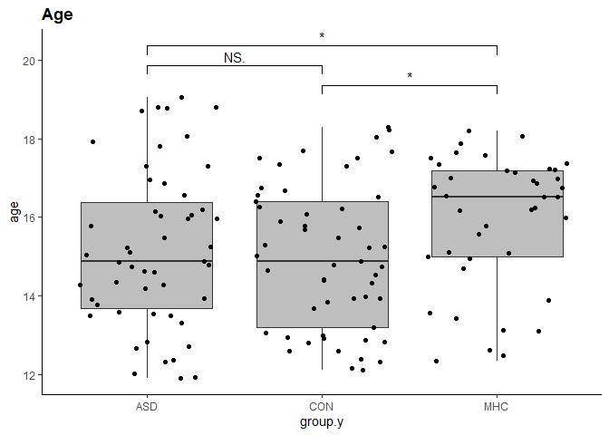<!-- -->

``` r
## Plot: IQ-verbal
plot_verbal_iq <- ggplot(sample_description_df, aes(x = group.y, y = verbal_IQ), col = group.y) + 
  geom_boxplot(fill = "grey") +
  geom_signif(comparisons = list(c("ASD", "CON"), c("ASD", "MHC"), c("MHC", "CON")),
              map_signif_level=TRUE,
              y_position = c(135, 140, 130)) +
  theme_bw() + 
  theme_classic() +
  ggtitle("IQ-verbal") +
  theme(plot.title = element_text(face="bold")) +
  theme(plot.margin = unit(c(1, 0.5, 0.5, 0.5), "cm"))

## Plot: IQ-non-verbal
plot_non_verbal_iq <- ggplot(sample_description_df, aes(x = group.y, y = non_verbal_IQ), col = "group.y") + 
  geom_boxplot(fill = "grey") +
  geom_signif(comparisons = list(c("ASD", "CON"), c("ASD", "MHC"), c("MHC", "CON")),
              map_signif_level=TRUE,
              y_position = c(135, 140, 130)) +
  theme_bw() + 
  theme_classic() +
  ggtitle("IQ-non-verbal") +
  theme(plot.title = element_text(face="bold")) +
  theme(plot.margin = unit(c(1, 0.5, 0.5, 0.5), "cm"))
  
grid.arrange(plot_verbal_iq, plot_non_verbal_iq, ncol = 2)
```

    ## Warning: Removed 4 rows containing non-finite outside the scale range
    ## (`stat_boxplot()`).

    ## Warning: Removed 4 rows containing non-finite outside the scale range
    ## (`stat_signif()`).

    ## Warning in wilcox.test.default(c(90, 110, 95, 87.5, 112.5, 102.5, 107.5, : kann
    ## bei Bindungen keinen exakten p-Wert Berechnen

    ## Warning: Removed 4 rows containing non-finite outside the scale range
    ## (`stat_boxplot()`).

    ## Warning: Removed 4 rows containing non-finite outside the scale range
    ## (`stat_signif()`).

    ## Warning in wilcox.test.default(c(107.5, 115, 92.5, 100, 102.5, 90, 132.5, :
    ## kann bei Bindungen keinen exakten p-Wert Berechnen

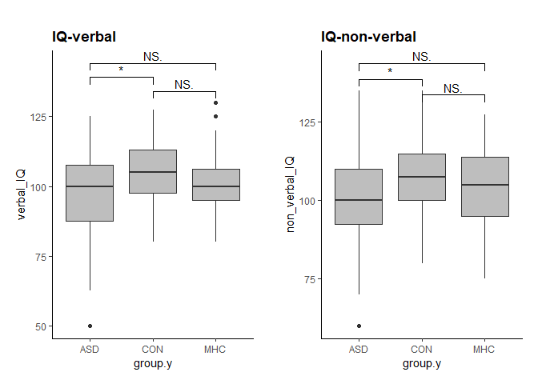<!-- -->

``` r
hist(df_grip$trial_corr_rpd, main = "Histogram of Trial Corrected RPD", xlab = "Trial Corrected RPD", col = "lightblue", border = "black")
```

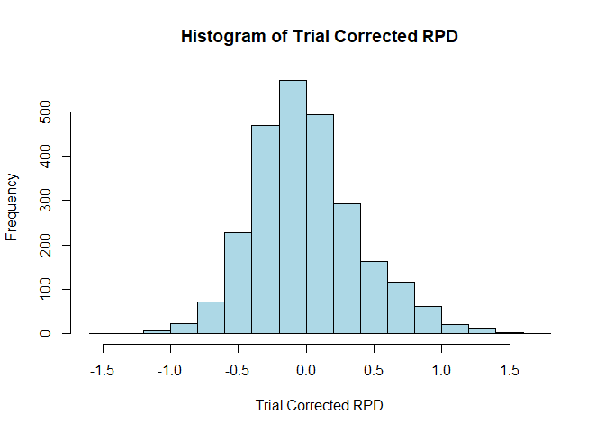<!-- -->

``` r
# Compute descriptive stats
mean_value <- mean(df_grip$trial_corr_rpd, na.rm = TRUE)
sd_value <- sd(df_grip$trial_corr_rpd, na.rm = TRUE)
median_value <- median(df_grip$trial_corr_rpd, na.rm = TRUE)
min_value <- min(df_grip$trial_corr_rpd, na.rm = TRUE)
max_value <- max(df_grip$trial_corr_rpd, na.rm = TRUE)

# Create a table
descriptives <- data.frame(
  Statistic = c("Mean", "Standard Deviation", "Median", "Min", "Max"),
  Value = round(c(mean_value, sd_value, median_value, min_value, max_value), 3)
)

# Show as table
knitr::kable(descriptives, caption = "Descriptive Statistics for trial_corr_rpd")
```

| Statistic          |  Value |
|:-------------------|-------:|
| Mean               |  0.002 |
| Standard Deviation |  0.396 |
| Median             | -0.041 |
| Min                | -1.440 |
| Max                |  1.603 |

Descriptive Statistics for trial_corr_rpd

## Covariate Check

``` r
# gender as a factor
df_grip$gender <- as.factor(df_grip$gender)

# Fit a mixed model with covariates
lmm_covariates <- lmer(trial_corr_rpd ~ verbal_IQ + non_verbal_IQ + age + gender + grip_strength.y + (1|id), data = df_grip, REML = FALSE)
```

    ## boundary (singular) fit: see help('isSingular')

``` r
anova_table <- anova(lmm_covariates)
knitr::kable(anova_table, caption = "ANOVA Results")
```

|                 |    Sum Sq |   Mean Sq | NumDF | DenDF |   F value |   Pr(\>F) |
|:----------------|----------:|----------:|------:|------:|----------:|----------:|
| verbal_IQ       | 0.0681421 | 0.0681421 |     1 |  2443 | 0.4365761 | 0.5088420 |
| non_verbal_IQ   | 0.0140252 | 0.0140252 |     1 |  2443 | 0.0898571 | 0.7643844 |
| age             | 0.0939354 | 0.0939354 |     1 |  2443 | 0.6018295 | 0.4379559 |
| gender          | 0.0018643 | 0.0018643 |     1 |  2443 | 0.0119444 | 0.9129811 |
| grip_strength.y | 0.3545530 | 0.3545530 |     1 |  2443 | 2.2715668 | 0.1318959 |

ANOVA Results

## Linear Mixed-Effects Model: Effect of Experimental Manipulation

``` r
# Result 1:
df_grip$trial_phase <- factor(
  df_grip$trial_phase,
  levels = c("baseline_pre_squeeze", "squeeze", "baseline_post_squeeze", "relax")
)

lmm_baseline <- lmer(
  trial_corr_rpd ~ trial_phase + (1 | id),
  data = df_grip
)
anova_table <- anova(lmm_baseline)
knitr::kable(anova_table, caption = "ANOVA Results")
```

|             |   Sum Sq |  Mean Sq | NumDF |    DenDF | F value | Pr(\>F) |
|:------------|---------:|---------:|------:|---------:|--------:|--------:|
| trial_phase | 120.7409 | 40.24696 |     3 | 2438.447 | 370.476 |       0 |

ANOVA Results

``` r
r2_nakagawa(lmm_baseline)  
```

    ## # R2 for Mixed Models
    ## 
    ##   Conditional R2: 0.309
    ##      Marginal R2: 0.304

``` r
# Compute estimated marginal means
emm_result <- emmeans(lmm_baseline, ~ trial_phase)

# Display the EMMs as a clean markdown table
knitr::kable(emm_result, caption = "Estimated Marginal Means by Trial Phase")
```

| trial_phase           |     emmean |        SE |       df |   lower.CL |   upper.CL |
|:----------------------|-----------:|----------:|---------:|-----------:|-----------:|
| baseline_pre_squeeze  |  0.0199493 | 0.0132440 | 1289.834 | -0.0060330 |  0.0459315 |
| squeeze               |  0.3159303 | 0.0124144 | 1143.714 |  0.2915727 |  0.3402878 |
| baseline_post_squeeze | -0.2181855 | 0.0159738 | 1588.809 | -0.2495175 | -0.1868536 |
| relax                 | -0.1932390 | 0.0124227 | 1145.341 | -0.2176129 | -0.1688651 |

Estimated Marginal Means by Trial Phase

### Post Hoc

``` r
# Compute pairwise contrasts
emm_result <- emmeans(lmm_baseline, ~ trial_phase)
pairwise_contrasts <- contrast(emm_result, "pairwise")

# Display the contrasts
knitr::kable(pairwise_contrasts, caption = "Pairwise Comparisons Between Trial Phases")
```

| contrast | estimate | SE | df | t.ratio | p.value |
|:---|---:|---:|---:|---:|---:|
| baseline_pre_squeeze - squeeze | -0.2959810 | 0.0178807 | 2408.773 | -16.553106 | 0.0000000 |
| baseline_pre_squeeze - baseline_post_squeeze | 0.2381348 | 0.0205029 | 2482.686 | 11.614668 | 0.0000000 |
| baseline_pre_squeeze - relax | 0.2131883 | 0.0178866 | 2409.425 | 11.918866 | 0.0000000 |
| squeeze - baseline_post_squeeze | 0.5341158 | 0.0199840 | 2488.239 | 26.727237 | 0.0000000 |
| squeeze - relax | 0.5091693 | 0.0172819 | 2387.080 | 29.462648 | 0.0000000 |
| baseline_post_squeeze - relax | -0.0249465 | 0.0199885 | 2487.062 | -1.248043 | 0.5962416 |

Pairwise Comparisons Between Trial Phases

``` r
# Compute and display confidence intervals for the contrasts
pairwise_contrasts_ci <- confint(pairwise_contrasts)
knitr::kable(pairwise_contrasts_ci, caption = "95% Confidence Intervals for Pairwise Comparisons")
```

| contrast | estimate | SE | df | lower.CL | upper.CL |
|:---|---:|---:|---:|---:|---:|
| baseline_pre_squeeze - squeeze | -0.2959810 | 0.0178807 | 2408.773 | -0.3419491 | -0.2500129 |
| baseline_pre_squeeze - baseline_post_squeeze | 0.2381348 | 0.0205029 | 2482.686 | 0.1854264 | 0.2908432 |
| baseline_pre_squeeze - relax | 0.2131883 | 0.0178866 | 2409.425 | 0.1672049 | 0.2591717 |
| squeeze - baseline_post_squeeze | 0.5341158 | 0.0199840 | 2488.239 | 0.4827417 | 0.5854899 |
| squeeze - relax | 0.5091693 | 0.0172819 | 2387.080 | 0.4647404 | 0.5535982 |
| baseline_post_squeeze - relax | -0.0249465 | 0.0199885 | 2487.062 | -0.0763324 | 0.0264393 |

95% Confidence Intervals for Pairwise Comparisons

``` r
emmeans_result <- emmeans(lmm_baseline, ~ trial_phase)  
plot_data <- as.data.frame(emmeans_result)

# Ensure correct order of trial phases
plot_data$trial_phase <- factor(
  plot_data$trial_phase,
  levels = c("baseline_pre_squeeze", "squeeze", "baseline_post_squeeze", "relax")
)

# plot
emm_plot <- ggplot(plot_data) +
  geom_crossbar(aes(
    x = trial_phase, y = emmean,
    ymin = emmean - SE, ymax = emmean + SE),
    fill = "gray70", color = "black",
    width = 0.3, alpha = 0.8) +
  geom_errorbar(aes(
    x = trial_phase, ymin = lower.CL, ymax = upper.CL),
    width = 0.2, color = "black") +
  scale_x_discrete(labels = c(
    "baseline_pre_squeeze" = "Baseline Pre Grip",
    "squeeze" = "Grip",
    "baseline_post_squeeze" = "Baseline Post Grip",
    "relax" = "Relax"
  )) +
  theme_bw() +
  labs(
    title = "Estimated Marginal Pupil Response by Trial Phase",
    x = "Trial Phase",
    y = "Estimated Marginal Pupil Response"
  ) +
  theme(
    plot.title = element_text(face = "bold"),
    axis.text.x = element_text(angle = 45, hjust = 1)
  )

# Display plot
print(emm_plot)
```

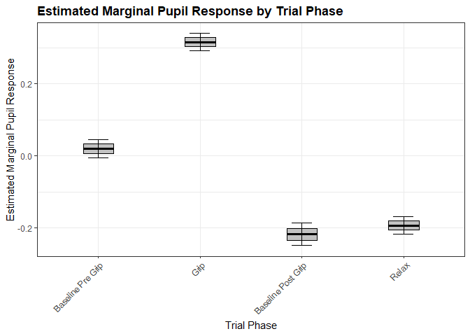<!-- -->

### Effort Check: Grip strength

``` r
df_grip %>%
  filter(trial_phase == "squeeze") %>%
  summarise(
    mean_grip = mean(grip_strength.y, na.rm = TRUE),
    sd_grip = sd(grip_strength.y, na.rm = TRUE)
  )
```

<div data-pagedtable="false">

<script data-pagedtable-source type="application/json">
{"columns":[{"label":["mean_grip"],"name":[1],"type":["dbl"],"align":["right"]},{"label":["sd_grip"],"name":[2],"type":["dbl"],"align":["right"]}],"data":[{"1":"42.3361","2":"16.56555"}],"options":{"columns":{"min":{},"max":[10]},"rows":{"min":[10],"max":[10]},"pages":{}}}
  </script>

</div>

``` r
lmm_grip <- lmer(trial_corr_rpd ~ grip_strength.y + (1 | id),
              data = df_grip)
```

    ## boundary (singular) fit: see help('isSingular')

``` r
anova_table <- anova(lmm_grip)
knitr::kable(anova_table, caption = "ANOVA Results")
```

|                 |    Sum Sq |   Mean Sq | NumDF | DenDF |  F value |   Pr(\>F) |
|:----------------|----------:|----------:|------:|------:|---------:|----------:|
| grip_strength.y | 0.3580207 | 0.3580207 |     1 |  2508 | 2.277853 | 0.1313594 |

ANOVA Results

``` r
lmm_gripstrength <- lmer(
  trial_corr_rpd ~ trial_phase * grip_strength.y + (1 | id),
  data = df_grip 
)
anova(lmm_gripstrength)
```

<div data-pagedtable="false">

<script data-pagedtable-source type="application/json">
{"columns":[{"label":[""],"name":["_rn_"],"type":[""],"align":["left"]},{"label":["Sum Sq"],"name":[1],"type":["dbl"],"align":["right"]},{"label":["Mean Sq"],"name":[2],"type":["dbl"],"align":["right"]},{"label":["NumDF"],"name":[3],"type":["int"],"align":["right"]},{"label":["DenDF"],"name":[4],"type":["dbl"],"align":["right"]},{"label":["F value"],"name":[5],"type":["dbl"],"align":["right"]},{"label":["Pr(>F)"],"name":[6],"type":["dbl"],"align":["right"]}],"data":[{"1":"4.971235","2":"1.657078","3":"3","4":"2413.9406","5":"15.634866","6":"4.518163e-10","_rn_":"trial_phase"},{"1":"0.140108","2":"0.140108","3":"1","4":"268.8517","5":"1.321947","6":"2.512647e-01","_rn_":"grip_strength.y"},{"1":"7.760945","2":"2.586982","3":"3","4":"2418.8881","5":"24.408690","6":"1.475135e-15","_rn_":"trial_phase:grip_strength.y"}],"options":{"columns":{"min":{},"max":[10]},"rows":{"min":[10],"max":[10]},"pages":{}}}
  </script>

</div>

``` r
knitr::kable(anova_table, caption = "ANOVA Results")
```

|                 |    Sum Sq |   Mean Sq | NumDF | DenDF |  F value |   Pr(\>F) |
|:----------------|----------:|----------:|------:|------:|---------:|----------:|
| grip_strength.y | 0.3580207 | 0.3580207 |     1 |  2508 | 2.277853 | 0.1313594 |

ANOVA Results

``` r
# Compute estimated marginal trends of grip_strength.y by trial phase
trend_result <- emtrends(
  lmm_gripstrength,
  ~ trial_phase,
  var = "grip_strength.y",
  infer = c(TRUE, TRUE)
)

# Display as Markdown table
knitr::kable(trend_result, caption = "Estimated Slopes of Grip Strength by Trial Phase")
```

| trial_phase | grip_strength.y.trend | SE | df | lower.CL | upper.CL | t.ratio | p.value |
|:---|---:|---:|---:|---:|---:|---:|---:|
| baseline_pre_squeeze | -0.0021045 | 0.0008087 | 1668.160 | -0.0036907 | -0.0005183 | -2.6022198 | 0.0093443 |
| squeeze | 0.0058629 | 0.0007431 | 1515.823 | 0.0044053 | 0.0073205 | 7.8897878 | 0.0000000 |
| baseline_post_squeeze | -0.0000888 | 0.0010229 | 2060.868 | -0.0020948 | 0.0019173 | -0.0867637 | 0.9308678 |
| relax | -0.0016818 | 0.0007452 | 1531.607 | -0.0031435 | -0.0002200 | -2.2567923 | 0.0241615 |

Estimated Slopes of Grip Strength by Trial Phase

## Group differences

``` r
# Result 2:
# Ensure group is treated as factor
df_grip$group.y <- as.factor(df_grip$group.y)

# Fit model
lmm_group <- lmer(
  trial_corr_rpd ~ trial_phase * group.y + (1 | id),
  data = df_grip
)

# Run and display ANOVA table
anova_table <- anova(lmm_group)
knitr::kable(anova_table, caption = "ANOVA Results")
```

|  | Sum Sq | Mean Sq | NumDF | DenDF | F value | Pr(\>F) |
|:---|---:|---:|---:|---:|---:|---:|
| trial_phase | 117.9422619 | 39.3140873 | 3 | 2431.1943 | 364.508410 | 0.0000000 |
| group.y | 0.2747287 | 0.1373643 | 2 | 142.8635 | 1.273601 | 0.2829797 |
| trial_phase:group.y | 2.5042515 | 0.4173752 | 6 | 2430.4815 | 3.869778 | 0.0007549 |

ANOVA Results

``` r
# Compute and display marginal and conditional R²
r2_values <- r2_nakagawa(lmm_group)
knitr::kable(r2_values, caption = "Nakagawa R² for Mixed Model")
```

<table class="kable_wrapper">
<caption>
Nakagawa R² for Mixed Model
</caption>
<tbody>
<tr>
<td>

|                |         x |
|:---------------|----------:|
| Conditional R2 | 0.3150516 |

</td>
<td>

|             |         x |
|:------------|----------:|
| Marginal R2 | 0.3104566 |

</td>
</tr>
</tbody>
</table>

``` r
# Compute estimated marginal means of group within each trial phase
emm_group_trial <- emmeans(lmm_group, ~ group.y | trial_phase)

# Display as markdown table
knitr::kable(emm_group_trial, caption = "Estimated Marginal Means: Group within Trial Phase")
```

| group.y | trial_phase | emmean | SE | df | lower.CL | upper.CL |
|:---|:---|---:|---:|---:|---:|---:|
| ASD | baseline_pre_squeeze | 0.0432599 | 0.0224800 | 1304.841 | -0.0008409 | 0.0873608 |
| CON | baseline_pre_squeeze | 0.0103552 | 0.0217051 | 1290.571 | -0.0322261 | 0.0529364 |
| MHC | baseline_pre_squeeze | 0.0042122 | 0.0247502 | 1197.652 | -0.0443463 | 0.0527707 |
| ASD | squeeze | 0.2752727 | 0.0209885 | 1162.438 | 0.2340931 | 0.3164522 |
| CON | squeeze | 0.3813863 | 0.0205098 | 1152.652 | 0.3411455 | 0.4216270 |
| MHC | squeeze | 0.2821764 | 0.0230776 | 1042.212 | 0.2368926 | 0.3274602 |
| ASD | baseline_post_squeeze | -0.2250791 | 0.0255942 | 1581.449 | -0.2752812 | -0.1748770 |
| CON | baseline_post_squeeze | -0.1913400 | 0.0274394 | 1650.163 | -0.2451597 | -0.1375202 |
| MHC | baseline_post_squeeze | -0.2412378 | 0.0303180 | 1451.772 | -0.3007095 | -0.1817660 |
| ASD | relax | -0.1605750 | 0.0209482 | 1157.506 | -0.2016756 | -0.1194743 |
| CON | relax | -0.2296909 | 0.0205476 | 1157.299 | -0.2700057 | -0.1893761 |
| MHC | relax | -0.1870247 | 0.0231315 | 1047.228 | -0.2324141 | -0.1416353 |

Estimated Marginal Means: Group within Trial Phase

### Post Hoc

``` r
# pairwise phase comparison within each group (not about group differences)
contrast(emmeans(lmm_group, ~ trial_phase | group.y), "pairwise")
```

    ## group.y = ASD:
    ##  contrast                                     estimate     SE   df t.ratio
    ##  baseline_pre_squeeze - squeeze                -0.2320 0.0303 2408  -7.660
    ##  baseline_pre_squeeze - baseline_post_squeeze   0.2683 0.0336 2452   7.978
    ##  baseline_pre_squeeze - relax                   0.2038 0.0303 2411   6.736
    ##  squeeze - baseline_post_squeeze                0.5004 0.0327 2453  15.316
    ##  squeeze - relax                                0.4358 0.0292 2382  14.941
    ##  baseline_post_squeeze - relax                 -0.0645 0.0326 2449  -1.976
    ##  p.value
    ##   <.0001
    ##   <.0001
    ##   <.0001
    ##   <.0001
    ##   <.0001
    ##   0.1973
    ## 
    ## group.y = CON:
    ##  contrast                                     estimate     SE   df t.ratio
    ##  baseline_pre_squeeze - squeeze                -0.3710 0.0294 2397 -12.619
    ##  baseline_pre_squeeze - baseline_post_squeeze   0.2017 0.0346 2480   5.834
    ##  baseline_pre_squeeze - relax                   0.2400 0.0294 2395   8.157
    ##  squeeze - baseline_post_squeeze                0.5727 0.0339 2496  16.916
    ##  squeeze - relax                                0.6111 0.0286 2381  21.398
    ##  baseline_post_squeeze - relax                  0.0384 0.0339 2495   1.132
    ##  p.value
    ##   <.0001
    ##   <.0001
    ##   <.0001
    ##   <.0001
    ##   <.0001
    ##   0.6697
    ## 
    ## group.y = MHC:
    ##  contrast                                     estimate     SE   df t.ratio
    ##  baseline_pre_squeeze - squeeze                -0.2780 0.0333 2403  -8.354
    ##  baseline_pre_squeeze - baseline_post_squeeze   0.2454 0.0386 2494   6.356
    ##  baseline_pre_squeeze - relax                   0.1912 0.0333 2404   5.741
    ##  squeeze - baseline_post_squeeze                0.5234 0.0376 2492  13.931
    ##  squeeze - relax                                0.4692 0.0321 2381  14.622
    ##  baseline_post_squeeze - relax                 -0.0542 0.0376 2492  -1.442
    ##  p.value
    ##   <.0001
    ##   <.0001
    ##   <.0001
    ##   <.0001
    ##   <.0001
    ##   0.4734
    ## 
    ## Degrees-of-freedom method: kenward-roger 
    ## P value adjustment: tukey method for comparing a family of 4 estimates

``` r
confint(contrast(emmeans(lmm_group, ~ trial_phase | group.y), "pairwise"))
```

<div data-pagedtable="false">

<script data-pagedtable-source type="application/json">
{"columns":[{"label":[""],"name":["_rn_"],"type":[""],"align":["left"]},{"label":["contrast"],"name":[1],"type":["fct"],"align":["left"]},{"label":["group.y"],"name":[2],"type":["fct"],"align":["left"]},{"label":["estimate"],"name":[3],"type":["dbl"],"align":["right"]},{"label":["SE"],"name":[4],"type":["dbl"],"align":["right"]},{"label":["df"],"name":[5],"type":["dbl"],"align":["right"]},{"label":["lower.CL"],"name":[6],"type":["dbl"],"align":["right"]},{"label":["upper.CL"],"name":[7],"type":["dbl"],"align":["right"]}],"data":[{"1":"baseline_pre_squeeze - squeeze","2":"ASD","3":"-0.23201272","4":"0.03028792","5":"2407.590","6":"-0.3098777","7":"-0.15414774","_rn_":"1"},{"1":"baseline_pre_squeeze - baseline_post_squeeze","2":"ASD","3":"0.26833907","4":"0.03363551","5":"2452.212","6":"0.1818691","7":"0.35480905","_rn_":"2"},{"1":"baseline_pre_squeeze - relax","2":"ASD","3":"0.20383489","4":"0.03026206","5":"2411.295","6":"0.1260365","7":"0.28163331","_rn_":"3"},{"1":"squeeze - baseline_post_squeeze","2":"ASD","3":"0.50035179","4":"0.03266886","5":"2452.617","6":"0.4163669","7":"0.58433670","_rn_":"4"},{"1":"squeeze - relax","2":"ASD","3":"0.43584761","4":"0.02917136","5":"2381.495","6":"0.3608525","7":"0.51084270","_rn_":"5"},{"1":"baseline_post_squeeze - relax","2":"ASD","3":"-0.06450418","4":"0.03264088","5":"2449.273","6":"-0.1484172","7":"0.01940887","_rn_":"6"},{"1":"baseline_pre_squeeze - squeeze","2":"CON","3":"-0.37103109","4":"0.02940173","5":"2396.734","6":"-0.4466181","7":"-0.29544409","_rn_":"7"},{"1":"baseline_pre_squeeze - baseline_post_squeeze","2":"CON","3":"0.20169515","4":"0.03457481","5":"2480.475","6":"0.1128111","7":"0.29057917","_rn_":"8"},{"1":"baseline_pre_squeeze - relax","2":"CON","3":"0.24004610","4":"0.02942707","5":"2394.759","6":"0.1643939","7":"0.31569828","_rn_":"9"},{"1":"squeeze - baseline_post_squeeze","2":"CON","3":"0.57272624","4":"0.03385662","5":"2495.584","6":"0.4856889","7":"0.65976359","_rn_":"10"},{"1":"squeeze - relax","2":"CON","3":"0.61107719","4":"0.02855790","5":"2380.519","6":"0.5376592","7":"0.68449518","_rn_":"11"},{"1":"baseline_post_squeeze - relax","2":"CON","3":"0.03835095","4":"0.03387847","5":"2494.693","6":"-0.0487426","7":"0.12544450","_rn_":"12"},{"1":"baseline_pre_squeeze - squeeze","2":"MHC","3":"-0.27796427","4":"0.03327227","5":"2403.482","6":"-0.3635016","7":"-0.19242692","_rn_":"13"},{"1":"baseline_pre_squeeze - baseline_post_squeeze","2":"MHC","3":"0.24544994","4":"0.03861696","5":"2493.690","6":"0.1461748","7":"0.34472505","_rn_":"14"},{"1":"baseline_pre_squeeze - relax","2":"MHC","3":"0.19123684","4":"0.03330923","5":"2403.536","6":"0.1056045","7":"0.27686920","_rn_":"15"},{"1":"squeeze - baseline_post_squeeze","2":"MHC","3":"0.52341421","4":"0.03757257","5":"2491.587","6":"0.4268239","7":"0.62000450","_rn_":"16"},{"1":"squeeze - relax","2":"MHC","3":"0.46920111","4":"0.03208842","5":"2380.607","6":"0.3867067","7":"0.55169554","_rn_":"17"},{"1":"baseline_post_squeeze - relax","2":"MHC","3":"-0.05421309","4":"0.03760630","5":"2492.372","6":"-0.1508901","7":"0.04246390","_rn_":"18"}],"options":{"columns":{"min":{},"max":[10]},"rows":{"min":[10],"max":[10]},"pages":{}}}
  </script>

</div>

``` r
# Compute estimated marginal means of group within each trial phase
emm_group_trial <- emmeans(lmm_group, ~ group.y | trial_phase)

# Compute pairwise group comparisons within each trial phase
group_comparisons <- contrast(emm_group_trial, "pairwise")
knitr::kable(group_comparisons, caption = "Pairwise Group Comparisons within Trial Phase")
```

| contrast | trial_phase | estimate | SE | df | t.ratio | p.value |
|:---|:---|---:|---:|---:|---:|---:|
| ASD - CON | baseline_pre_squeeze | 0.0329048 | 0.0312484 | 1297.936 | 1.0530054 | 0.5435548 |
| ASD - MHC | baseline_pre_squeeze | 0.0390478 | 0.0334353 | 1244.972 | 1.1678600 | 0.4726627 |
| CON - MHC | baseline_pre_squeeze | 0.0061430 | 0.0329194 | 1237.197 | 0.1866080 | 0.9809861 |
| ASD - CON | squeeze | -0.1061136 | 0.0293457 | 1157.646 | -3.6159891 | 0.0009100 |
| ASD - MHC | squeeze | -0.0069038 | 0.0311944 | 1094.847 | -0.2213148 | 0.9733605 |
| CON - MHC | squeeze | 0.0992098 | 0.0308744 | 1089.436 | 3.2133401 | 0.0038586 |
| ASD - CON | baseline_post_squeeze | -0.0337392 | 0.0375231 | 1617.964 | -0.8991569 | 0.6409118 |
| ASD - MHC | baseline_post_squeeze | 0.0161586 | 0.0396767 | 1504.778 | 0.4072572 | 0.9126480 |
| CON - MHC | baseline_post_squeeze | 0.0498978 | 0.0408914 | 1538.947 | 1.2202532 | 0.4413275 |
| ASD - CON | relax | 0.0691160 | 0.0293433 | 1157.404 | 2.3554236 | 0.0489136 |
| ASD - MHC | relax | 0.0264497 | 0.0312073 | 1095.415 | 0.8475501 | 0.6734759 |
| CON - MHC | relax | -0.0426662 | 0.0309398 | 1094.283 | -1.3790072 | 0.3522786 |

Pairwise Group Comparisons within Trial Phase

``` r
# Confidence intervals for the pairwise comparisons
group_comparisons_ci <- confint(group_comparisons)
knitr::kable(group_comparisons_ci, caption = "95% Confidence Intervals for Pairwise Group Comparisons")
```

| contrast | trial_phase | estimate | SE | df | lower.CL | upper.CL |
|:---|:---|---:|---:|---:|---:|---:|
| ASD - CON | baseline_pre_squeeze | 0.0329048 | 0.0312484 | 1297.936 | -0.0404165 | 0.1062260 |
| ASD - MHC | baseline_pre_squeeze | 0.0390478 | 0.0334353 | 1244.972 | -0.0394086 | 0.1175041 |
| CON - MHC | baseline_pre_squeeze | 0.0061430 | 0.0329194 | 1237.197 | -0.0711032 | 0.0833893 |
| ASD - CON | squeeze | -0.1061136 | 0.0293457 | 1157.646 | -0.1749798 | -0.0372474 |
| ASD - MHC | squeeze | -0.0069038 | 0.0311944 | 1094.847 | -0.0801139 | 0.0663063 |
| CON - MHC | squeeze | 0.0992098 | 0.0308744 | 1089.436 | 0.0267503 | 0.1716693 |
| ASD - CON | baseline_post_squeeze | -0.0337392 | 0.0375231 | 1617.964 | -0.1217633 | 0.0542849 |
| ASD - MHC | baseline_post_squeeze | 0.0161586 | 0.0396767 | 1504.778 | -0.0769240 | 0.1092413 |
| CON - MHC | baseline_post_squeeze | 0.0498978 | 0.0408914 | 1538.947 | -0.0460323 | 0.1458279 |
| ASD - CON | relax | 0.0691160 | 0.0293433 | 1157.404 | 0.0002552 | 0.1379767 |
| ASD - MHC | relax | 0.0264497 | 0.0312073 | 1095.415 | -0.0467905 | 0.0996899 |
| CON - MHC | relax | -0.0426662 | 0.0309398 | 1094.283 | -0.1152789 | 0.0299464 |

95% Confidence Intervals for Pairwise Group Comparisons

``` r
# Compute estimated marginal means
emm_result <- emmeans(lmm_group, ~ group.y | trial_phase)
emm_data <- as.data.frame(emm_result)

# Ensure correct phase order
emm_data$trial_phase <- factor(
  emm_data$trial_phase,
  levels = c("baseline_pre_squeeze", "squeeze", "baseline_post_squeeze", "relax")
)

# Plot estimated marginal means with confidence intervals
ggplot(emm_data, aes(x = trial_phase, y = emmean, color = group.y)) +
  geom_point(size = 3, position = position_dodge(width = 0.5)) +
  geom_errorbar(
    aes(ymin = lower.CL, ymax = upper.CL),
    width = 0.2,
    size = 1,
    position = position_dodge(width = 0.5)
  ) +
  facet_wrap(~ group.y) +
  scale_x_discrete(labels = c(
    "baseline_pre_squeeze" = "Baseline Pre Grip",
    "squeeze" = "Grip",
    "baseline_post_squeeze" = "Baseline Post Grip",
    "relax" = "Relax"
  )) +
  labs(
    title = "Estimated Marginal Pupil Response by Group and Trial Phase",
    x = "Trial Phase",
    y = "Estimated Marginal Pupil Response"
  ) +
  theme_bw() +
  scale_color_manual(values = c("ASD" = "red", "CON" = "#045D5D", "MHC" = "#A05000")) +
  theme(
    plot.title = element_text(face = "bold"),
    legend.position = "none",
    axis.text.x = element_text(face = "bold", angle = 45, hjust = 1),
    axis.text.y = element_text(face = "bold"),
    text = element_text(size = 14)
  )
```

    ## Warning: Using `size` aesthetic for lines was deprecated in ggplot2 3.4.0.
    ## ℹ Please use `linewidth` instead.
    ## This warning is displayed once every 8 hours.
    ## Call `lifecycle::last_lifecycle_warnings()` to see where this warning was
    ## generated.

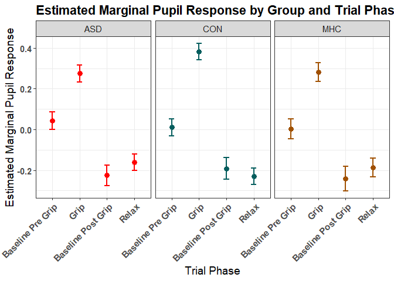<!-- -->

``` r
# Plot estimated marginal means by phase (facets), color = group
ggplot(emm_data, aes(x = group.y, y = emmean, color = group.y)) +
  geom_point(size = 3, position = position_dodge(width = 0.5)) +
  geom_errorbar(
    aes(ymin = lower.CL, ymax = upper.CL),
    width = 0.2,
    size = 1,
    position = position_dodge(width = 0.5)
  ) +
  facet_wrap(~ trial_phase) +
  scale_color_manual(values = c(
    "ASD" = "#9900CC",   # bright purple
    "CON" = "#00FF00",   # bright green
    "MHC" = "#00FFFF"    # bright cyan
  )) +
  labs(
    title = "Estimated Marginal Pupil Response by Trial Phase and Group",
    x = "Group",
    y = "Estimated Marginal Pupil Response"
  ) +
  theme_bw() +
  theme(
    plot.title = element_text(face = "bold"),
    legend.position = "none",
    axis.text.x = element_text(face = "bold"),
    axis.text.y = element_text(face = "bold"),
    text = element_text(size = 14)
  )
```

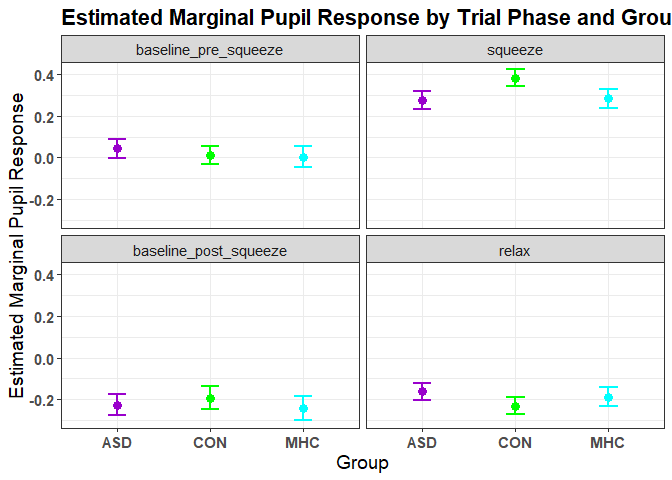<!-- -->

## Across Manipulation trials - Habituation Effects

``` r
# Result 3:
# Ensure manipulation_trial is a factor
df_grip$manipulation_trial <- as.factor(df_grip$manipulation_trial)

# Fit mixed-effects model
lmm_trials <- lmer(
  trial_corr_rpd ~ manipulation_trial * trial_phase + (1 | id),
  data = df_grip
)

# Run and display ANOVA table
anova_table <- anova(lmm_trials)
knitr::kable(anova_table, caption = "ANOVA Results for Manipulation Trial × Trial Phase")
```

|  | Sum Sq | Mean Sq | NumDF | DenDF | F value | Pr(\>F) |
|:---|---:|---:|---:|---:|---:|---:|
| manipulation_trial | 8.313045 | 2.078261 | 4 | 2398.186 | 20.402571 | 0 |
| trial_phase | 119.862174 | 39.954058 | 3 | 2418.510 | 392.234370 | 0 |
| manipulation_trial:trial_phase | 6.273156 | 0.522763 | 12 | 2392.232 | 5.132035 | 0 |

ANOVA Results for Manipulation Trial × Trial Phase

``` r
# Compute and display marginal/conditional R²
r2_trials <- r2_nakagawa(lmm_trials)
knitr::kable(r2_trials, caption = "Nakagawa R² for Manipulation Trial Model")
```

<table class="kable_wrapper">
<caption>
Nakagawa R² for Manipulation Trial Model
</caption>
<tbody>
<tr>
<td>

|                |         x |
|:---------------|----------:|
| Conditional R2 | 0.3541884 |

</td>
<td>

|             |         x |
|:------------|----------:|
| Marginal R2 | 0.3472014 |

</td>
</tr>
</tbody>
</table>

### Post Hoc

``` r
# Compute estimated marginal means of trial_phase within each manipulation trial
emm_phase_within_trial <- emmeans(lmm_trials, ~ trial_phase | manipulation_trial)

# Compute pairwise comparisons
phase_comparisons <- contrast(emm_phase_within_trial, "pairwise")
knitr::kable(phase_comparisons, caption = "Pairwise Comparisons: Trial Phase within Manipulation Trial")
```

| contrast | manipulation_trial | estimate | SE | df | t.ratio | p.value |
|:---|:---|---:|---:|---:|---:|---:|
| baseline_pre_squeeze - squeeze | 1 | -0.2119543 | 0.0390553 | 2387.772 | -5.4270321 | 0.0000004 |
| baseline_pre_squeeze - baseline_post_squeeze | 1 | 0.0510154 | 0.0460228 | 2433.853 | 1.1084819 | 0.6843377 |
| baseline_pre_squeeze - relax | 1 | 0.1527410 | 0.0389943 | 2388.517 | 3.9170093 | 0.0005339 |
| squeeze - baseline_post_squeeze | 1 | 0.2629697 | 0.0447013 | 2430.215 | 5.8828255 | 0.0000000 |
| squeeze - relax | 1 | 0.3646953 | 0.0374198 | 2370.503 | 9.7460479 | 0.0000000 |
| baseline_post_squeeze - relax | 1 | 0.1017256 | 0.0446480 | 2430.784 | 2.2783900 | 0.1033502 |
| baseline_pre_squeeze - squeeze | 2 | -0.3569369 | 0.0382662 | 2380.407 | -9.3277459 | 0.0000000 |
| baseline_pre_squeeze - baseline_post_squeeze | 2 | 0.3113751 | 0.0427915 | 2415.428 | 7.2765609 | 0.0000000 |
| baseline_pre_squeeze - relax | 2 | 0.2067875 | 0.0382662 | 2380.407 | 5.4039286 | 0.0000004 |
| squeeze - baseline_post_squeeze | 2 | 0.6683120 | 0.0419838 | 2413.905 | 15.9183301 | 0.0000000 |
| squeeze - relax | 2 | 0.5637245 | 0.0373548 | 2369.698 | 15.0910931 | 0.0000000 |
| baseline_post_squeeze - relax | 2 | -0.1045875 | 0.0419838 | 2413.905 | -2.4911399 | 0.0615292 |
| baseline_pre_squeeze - squeeze | 3 | -0.3590125 | 0.0384988 | 2382.876 | -9.3252861 | 0.0000000 |
| baseline_pre_squeeze - baseline_post_squeeze | 3 | 0.2518950 | 0.0436824 | 2423.715 | 5.7665140 | 0.0000001 |
| baseline_pre_squeeze - relax | 3 | 0.1962570 | 0.0385621 | 2383.760 | 5.0893765 | 0.0000023 |
| squeeze - baseline_post_squeeze | 3 | 0.6109075 | 0.0426799 | 2418.865 | 14.3137185 | 0.0000000 |
| squeeze - relax | 3 | 0.5552695 | 0.0374198 | 2370.518 | 14.8389163 | 0.0000000 |
| baseline_post_squeeze - relax | 3 | -0.0556380 | 0.0427356 | 2418.221 | -1.3019138 | 0.5617637 |
| baseline_pre_squeeze - squeeze | 4 | -0.3231519 | 0.0385785 | 2383.889 | -8.3764781 | 0.0000000 |
| baseline_pre_squeeze - baseline_post_squeeze | 4 | 0.2828441 | 0.0437491 | 2421.171 | 6.4651416 | 0.0000000 |
| baseline_pre_squeeze - relax | 4 | 0.2182647 | 0.0387040 | 2383.923 | 5.6393279 | 0.0000001 |
| squeeze - baseline_post_squeeze | 4 | 0.6059960 | 0.0426798 | 2418.788 | 14.1986472 | 0.0000000 |
| squeeze - relax | 4 | 0.5414166 | 0.0374856 | 2371.329 | 14.4433107 | 0.0000000 |
| baseline_post_squeeze - relax | 4 | -0.0645794 | 0.0427939 | 2419.112 | -1.5090787 | 0.4321340 |
| baseline_pre_squeeze - squeeze | 5 | -0.2285710 | 0.0392281 | 2389.119 | -5.8267084 | 0.0000000 |
| baseline_pre_squeeze - baseline_post_squeeze | 5 | 0.2792011 | 0.0459936 | 2434.289 | 6.0704323 | 0.0000000 |
| baseline_pre_squeeze - relax | 5 | 0.2898838 | 0.0391674 | 2389.864 | 7.4011445 | 0.0000000 |
| squeeze - baseline_post_squeeze | 5 | 0.5077721 | 0.0445210 | 2430.963 | 11.4052167 | 0.0000000 |
| squeeze - relax | 5 | 0.5184548 | 0.0374198 | 2370.503 | 13.8550880 | 0.0000000 |
| baseline_post_squeeze - relax | 5 | 0.0106827 | 0.0444654 | 2429.886 | 0.2402471 | 0.9951244 |

Pairwise Comparisons: Trial Phase within Manipulation Trial

``` r
# Compute and display confidence intervals
phase_comparisons_ci <- confint(phase_comparisons)
knitr::kable(phase_comparisons_ci, caption = "95% CIs for Trial Phase Comparisons within Manipulation Trial")
```

| contrast | manipulation_trial | estimate | SE | df | lower.CL | upper.CL |
|:---|:---|---:|---:|---:|---:|---:|
| baseline_pre_squeeze - squeeze | 1 | -0.2119543 | 0.0390553 | 2387.772 | -0.3123593 | -0.1115494 |
| baseline_pre_squeeze - baseline_post_squeeze | 1 | 0.0510154 | 0.0460228 | 2433.853 | -0.0673003 | 0.1693311 |
| baseline_pre_squeeze - relax | 1 | 0.1527410 | 0.0389943 | 2388.517 | 0.0524929 | 0.2529891 |
| squeeze - baseline_post_squeeze | 1 | 0.2629697 | 0.0447013 | 2430.215 | 0.1480513 | 0.3778882 |
| squeeze - relax | 1 | 0.3646953 | 0.0374198 | 2370.503 | 0.2684944 | 0.4608962 |
| baseline_post_squeeze - relax | 1 | 0.1017256 | 0.0446480 | 2430.784 | -0.0130559 | 0.2165071 |
| baseline_pre_squeeze - squeeze | 2 | -0.3569369 | 0.0382662 | 2380.407 | -0.4553134 | -0.2585605 |
| baseline_pre_squeeze - baseline_post_squeeze | 2 | 0.3113751 | 0.0427915 | 2415.428 | 0.2013657 | 0.4213844 |
| baseline_pre_squeeze - relax | 2 | 0.2067875 | 0.0382662 | 2380.407 | 0.1084111 | 0.3051640 |
| squeeze - baseline_post_squeeze | 2 | 0.6683120 | 0.0419838 | 2413.905 | 0.5603791 | 0.7762449 |
| squeeze - relax | 2 | 0.5637245 | 0.0373548 | 2369.698 | 0.4676907 | 0.6597582 |
| baseline_post_squeeze - relax | 2 | -0.1045875 | 0.0419838 | 2413.905 | -0.2125204 | 0.0033454 |
| baseline_pre_squeeze - squeeze | 3 | -0.3590125 | 0.0384988 | 2382.876 | -0.4579870 | -0.2600380 |
| baseline_pre_squeeze - baseline_post_squeeze | 3 | 0.2518950 | 0.0436824 | 2423.715 | 0.1395957 | 0.3641943 |
| baseline_pre_squeeze - relax | 3 | 0.1962570 | 0.0385621 | 2383.760 | 0.0971198 | 0.2953941 |
| squeeze - baseline_post_squeeze | 3 | 0.6109075 | 0.0426799 | 2418.865 | 0.5011854 | 0.7206297 |
| squeeze - relax | 3 | 0.5552695 | 0.0374198 | 2370.518 | 0.4590686 | 0.6514704 |
| baseline_post_squeeze - relax | 3 | -0.0556380 | 0.0427356 | 2418.221 | -0.1655035 | 0.0542274 |
| baseline_pre_squeeze - squeeze | 4 | -0.3231519 | 0.0385785 | 2383.889 | -0.4223312 | -0.2239726 |
| baseline_pre_squeeze - baseline_post_squeeze | 4 | 0.2828441 | 0.0437491 | 2421.171 | 0.1703732 | 0.3953150 |
| baseline_pre_squeeze - relax | 4 | 0.2182647 | 0.0387040 | 2383.923 | 0.1187627 | 0.3177668 |
| squeeze - baseline_post_squeeze | 4 | 0.6059960 | 0.0426798 | 2418.788 | 0.4962739 | 0.7157181 |
| squeeze - relax | 4 | 0.5414166 | 0.0374856 | 2371.329 | 0.4450465 | 0.6377867 |
| baseline_post_squeeze - relax | 4 | -0.0645794 | 0.0427939 | 2419.112 | -0.1745947 | 0.0454360 |
| baseline_pre_squeeze - squeeze | 5 | -0.2285710 | 0.0392281 | 2389.119 | -0.3294203 | -0.1277217 |
| baseline_pre_squeeze - baseline_post_squeeze | 5 | 0.2792011 | 0.0459936 | 2434.289 | 0.1609604 | 0.3974418 |
| baseline_pre_squeeze - relax | 5 | 0.2898838 | 0.0391674 | 2389.864 | 0.1891906 | 0.3905770 |
| squeeze - baseline_post_squeeze | 5 | 0.5077721 | 0.0445210 | 2430.963 | 0.3933170 | 0.6222272 |
| squeeze - relax | 5 | 0.5184548 | 0.0374198 | 2370.503 | 0.4222539 | 0.6146557 |
| baseline_post_squeeze - relax | 5 | 0.0106827 | 0.0444654 | 2429.886 | -0.1036295 | 0.1249949 |

95% CIs for Trial Phase Comparisons within Manipulation Trial

``` r
# Get estimated marginal means
emms <- emmeans(lmm_trials, ~ trial_phase | manipulation_trial)

# Convert to a dataframe
emms_df <- as.data.frame(emms)

# Relabel trial_phase and manipulation_trial
emms_df <- emms_df %>%
  mutate(
    trial_phase = factor(trial_phase,
                         levels = c("baseline_pre_squeeze", "squeeze", "baseline_post_squeeze", "relax"),
                         labels = c("Baseline Pre-Grip", "Grip", "Baseline Post-Grip", "Relax")),
    trial = as.numeric(as.character(manipulation_trial))
  )

# Plot
ggplot(emms_df, aes(x = trial, 
                    y = emmean, 
                    color = trial_phase,
                    group = trial_phase)) +
  geom_line(size = 1.2) +
  geom_point(size = 2) +
  geom_errorbar(aes(ymin = lower.CL, ymax = upper.CL), width = 0.1) +
  labs(
    title = "Estimated Marginal Means of RPD by Trial Phase and Trial",
    x = "Trial",
    y = "Estimated Relative Pupil Dilation (RPD)",
    color = "Trial Phase"
  ) +
  theme_minimal(base_size = 14) +
  theme(legend.position = "right")
```

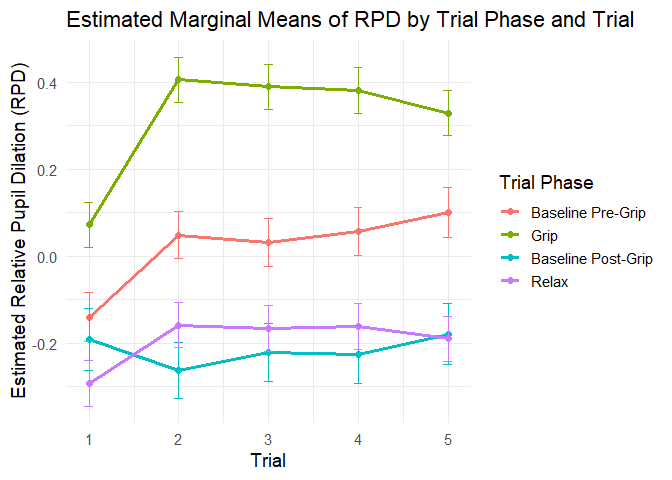<!-- -->

``` r
# Compute estimated marginal means of manipulation_trial within each trial phase
emm_trial_within_phase <- emmeans(lmm_trials, ~ manipulation_trial | trial_phase)

# Pairwise comparisons of manipulation_trial within each phase
trial_comparisons <- contrast(emm_trial_within_phase, "pairwise")
knitr::kable(trial_comparisons, caption = "Pairwise Comparisons: Manipulation Trial within Trial Phase")
```

| contrast | trial_phase | estimate | SE | df | t.ratio | p.value |
|:---|:---|---:|---:|---:|---:|---:|
| manipulation_trial1 - manipulation_trial2 | baseline_pre_squeeze | -0.1884494 | 0.0398650 | 2393.836 | -4.7271864 | 0.0000237 |
| manipulation_trial1 - manipulation_trial3 | baseline_pre_squeeze | -0.1704074 | 0.0400891 | 2396.472 | -4.2507130 | 0.0002145 |
| manipulation_trial1 - manipulation_trial4 | baseline_pre_squeeze | -0.1973027 | 0.0401659 | 2397.583 | -4.9121945 | 0.0000095 |
| manipulation_trial1 - manipulation_trial5 | baseline_pre_squeeze | -0.2399074 | 0.0407355 | 2405.906 | -5.8893987 | 0.0000000 |
| manipulation_trial2 - manipulation_trial3 | baseline_pre_squeeze | 0.0180421 | 0.0393812 | 2389.521 | 0.4581393 | 0.9909373 |
| manipulation_trial2 - manipulation_trial4 | baseline_pre_squeeze | -0.0088532 | 0.0394608 | 2392.050 | -0.2243556 | 0.9994388 |
| manipulation_trial2 - manipulation_trial5 | baseline_pre_squeeze | -0.0514579 | 0.0400327 | 2393.340 | -1.2853970 | 0.7002908 |
| manipulation_trial3 - manipulation_trial4 | baseline_pre_squeeze | -0.0268953 | 0.0396821 | 2389.628 | -0.6777695 | 0.9612562 |
| manipulation_trial3 - manipulation_trial5 | baseline_pre_squeeze | -0.0695000 | 0.0402559 | 2396.013 | -1.7264566 | 0.4177679 |
| manipulation_trial4 - manipulation_trial5 | baseline_pre_squeeze | -0.0426047 | 0.0403272 | 2391.811 | -1.0564757 | 0.8287094 |
| manipulation_trial1 - manipulation_trial2 | squeeze | -0.3334320 | 0.0374198 | 2370.503 | -8.9105752 | 0.0000000 |
| manipulation_trial1 - manipulation_trial3 | squeeze | -0.3174656 | 0.0374198 | 2370.503 | -8.4838898 | 0.0000000 |
| manipulation_trial1 - manipulation_trial4 | squeeze | -0.3085003 | 0.0374198 | 2370.503 | -8.2443026 | 0.0000000 |
| manipulation_trial1 - manipulation_trial5 | squeeze | -0.2565240 | 0.0374847 | 2371.311 | -6.8434262 | 0.0000000 |
| manipulation_trial2 - manipulation_trial3 | squeeze | 0.0159665 | 0.0373548 | 2369.698 | 0.4274283 | 0.9930471 |
| manipulation_trial2 - manipulation_trial4 | squeeze | 0.0249318 | 0.0373548 | 2369.698 | 0.6674326 | 0.9633365 |
| manipulation_trial2 - manipulation_trial5 | squeeze | 0.0769080 | 0.0374198 | 2370.503 | 2.0552750 | 0.2401569 |
| manipulation_trial3 - manipulation_trial4 | squeeze | 0.0089653 | 0.0373548 | 2369.698 | 0.2400043 | 0.9992676 |
| manipulation_trial3 - manipulation_trial5 | squeeze | 0.0609415 | 0.0374198 | 2370.503 | 1.6285895 | 0.4791186 |
| manipulation_trial4 - manipulation_trial5 | squeeze | 0.0519762 | 0.0374198 | 2370.503 | 1.3890023 | 0.6348194 |
| manipulation_trial1 - manipulation_trial2 | baseline_post_squeeze | 0.0719102 | 0.0485591 | 2431.279 | 1.4808794 | 0.5750575 |
| manipulation_trial1 - manipulation_trial3 | baseline_post_squeeze | 0.0304722 | 0.0491674 | 2437.697 | 0.6197649 | 0.9719728 |
| manipulation_trial1 - manipulation_trial4 | baseline_post_squeeze | 0.0345260 | 0.0491644 | 2435.577 | 0.7022569 | 0.9560220 |
| manipulation_trial1 - manipulation_trial5 | baseline_post_squeeze | -0.0117217 | 0.0507144 | 2436.941 | -0.2311311 | 0.9993688 |
| manipulation_trial2 - manipulation_trial3 | baseline_post_squeeze | -0.0414380 | 0.0467544 | 2420.021 | -0.8862904 | 0.9020486 |
| manipulation_trial2 - manipulation_trial4 | baseline_post_squeeze | -0.0373842 | 0.0467702 | 2431.783 | -0.7993171 | 0.9308522 |
| manipulation_trial2 - manipulation_trial5 | baseline_post_squeeze | -0.0836319 | 0.0483952 | 2432.662 | -1.7281023 | 0.4167575 |
| manipulation_trial3 - manipulation_trial4 | baseline_post_squeeze | 0.0040538 | 0.0473673 | 2413.654 | 0.0855815 | 0.9999879 |
| manipulation_trial3 - manipulation_trial5 | baseline_post_squeeze | -0.0421939 | 0.0489907 | 2428.846 | -0.8612643 | 0.9109509 |
| manipulation_trial4 - manipulation_trial5 | baseline_post_squeeze | -0.0462477 | 0.0489937 | 2430.852 | -0.9439525 | 0.8796606 |
| manipulation_trial1 - manipulation_trial2 | relax | -0.1344028 | 0.0373548 | 2369.698 | -3.5980093 | 0.0030171 |
| manipulation_trial1 - manipulation_trial3 | relax | -0.1268913 | 0.0374198 | 2370.518 | -3.3910203 | 0.0063568 |
| manipulation_trial1 - manipulation_trial4 | relax | -0.1317789 | 0.0374856 | 2371.329 | -3.5154508 | 0.0040838 |
| manipulation_trial1 - manipulation_trial5 | relax | -0.1027645 | 0.0373548 | 2369.698 | -2.7510411 | 0.0471711 |
| manipulation_trial2 - manipulation_trial3 | relax | 0.0075115 | 0.0374198 | 2370.518 | 0.2007359 | 0.9996387 |
| manipulation_trial2 - manipulation_trial4 | relax | 0.0026240 | 0.0374856 | 2371.329 | 0.0699989 | 0.9999946 |
| manipulation_trial2 - manipulation_trial5 | relax | 0.0316383 | 0.0373548 | 2369.698 | 0.8469681 | 0.9158127 |
| manipulation_trial3 - manipulation_trial4 | relax | -0.0048875 | 0.0375505 | 2372.156 | -0.1301594 | 0.9999354 |
| manipulation_trial3 - manipulation_trial5 | relax | 0.0241268 | 0.0374198 | 2370.518 | 0.6447603 | 0.9676372 |
| manipulation_trial4 - manipulation_trial5 | relax | 0.0290144 | 0.0374856 | 2371.329 | 0.7740128 | 0.9381112 |

Pairwise Comparisons: Manipulation Trial within Trial Phase

``` r
# Confidence intervals for those comparisons
trial_comparisons_ci <- confint(trial_comparisons)
knitr::kable(trial_comparisons_ci, caption = "95% CIs for Manipulation Trial Comparisons within Trial Phase")
```

| contrast | trial_phase | estimate | SE | df | lower.CL | upper.CL |
|:---|:---|---:|---:|---:|---:|---:|
| manipulation_trial1 - manipulation_trial2 | baseline_pre_squeeze | -0.1884494 | 0.0398650 | 2393.836 | -0.2972752 | -0.0796236 |
| manipulation_trial1 - manipulation_trial3 | baseline_pre_squeeze | -0.1704074 | 0.0400891 | 2396.472 | -0.2798448 | -0.0609699 |
| manipulation_trial1 - manipulation_trial4 | baseline_pre_squeeze | -0.1973027 | 0.0401659 | 2397.583 | -0.3069496 | -0.0876557 |
| manipulation_trial1 - manipulation_trial5 | baseline_pre_squeeze | -0.2399074 | 0.0407355 | 2405.906 | -0.3511089 | -0.1287059 |
| manipulation_trial2 - manipulation_trial3 | baseline_pre_squeeze | 0.0180421 | 0.0393812 | 2389.521 | -0.0894631 | 0.1255472 |
| manipulation_trial2 - manipulation_trial4 | baseline_pre_squeeze | -0.0088532 | 0.0394608 | 2392.050 | -0.1165755 | 0.0988690 |
| manipulation_trial2 - manipulation_trial5 | baseline_pre_squeeze | -0.0514579 | 0.0400327 | 2393.340 | -0.1607415 | 0.0578256 |
| manipulation_trial3 - manipulation_trial4 | baseline_pre_squeeze | -0.0268953 | 0.0396821 | 2389.628 | -0.1352219 | 0.0814312 |
| manipulation_trial3 - manipulation_trial5 | baseline_pre_squeeze | -0.0695000 | 0.0402559 | 2396.013 | -0.1793927 | 0.0403926 |
| manipulation_trial4 - manipulation_trial5 | baseline_pre_squeeze | -0.0426047 | 0.0403272 | 2391.811 | -0.1526922 | 0.0674828 |
| manipulation_trial1 - manipulation_trial2 | squeeze | -0.3334320 | 0.0374198 | 2370.503 | -0.4355835 | -0.2312806 |
| manipulation_trial1 - manipulation_trial3 | squeeze | -0.3174656 | 0.0374198 | 2370.503 | -0.4196170 | -0.2153141 |
| manipulation_trial1 - manipulation_trial4 | squeeze | -0.3085003 | 0.0374198 | 2370.503 | -0.4106517 | -0.2063488 |
| manipulation_trial1 - manipulation_trial5 | squeeze | -0.2565240 | 0.0374847 | 2371.311 | -0.3588527 | -0.1541954 |
| manipulation_trial2 - manipulation_trial3 | squeeze | 0.0159665 | 0.0373548 | 2369.698 | -0.0860075 | 0.1179404 |
| manipulation_trial2 - manipulation_trial4 | squeeze | 0.0249318 | 0.0373548 | 2369.698 | -0.0770422 | 0.1269058 |
| manipulation_trial2 - manipulation_trial5 | squeeze | 0.0769080 | 0.0374198 | 2370.503 | -0.0252435 | 0.1790595 |
| manipulation_trial3 - manipulation_trial4 | squeeze | 0.0089653 | 0.0373548 | 2369.698 | -0.0930087 | 0.1109393 |
| manipulation_trial3 - manipulation_trial5 | squeeze | 0.0609415 | 0.0374198 | 2370.503 | -0.0412099 | 0.1630930 |
| manipulation_trial4 - manipulation_trial5 | squeeze | 0.0519762 | 0.0374198 | 2370.503 | -0.0501753 | 0.1541277 |
| manipulation_trial1 - manipulation_trial2 | baseline_post_squeeze | 0.0719102 | 0.0485591 | 2431.279 | -0.0606477 | 0.2044681 |
| manipulation_trial1 - manipulation_trial3 | baseline_post_squeeze | 0.0304722 | 0.0491674 | 2437.697 | -0.1037459 | 0.1646904 |
| manipulation_trial1 - manipulation_trial4 | baseline_post_squeeze | 0.0345260 | 0.0491644 | 2435.577 | -0.0996838 | 0.1687359 |
| manipulation_trial1 - manipulation_trial5 | baseline_post_squeeze | -0.0117217 | 0.0507144 | 2436.941 | -0.1501628 | 0.1267194 |
| manipulation_trial2 - manipulation_trial3 | baseline_post_squeeze | -0.0414380 | 0.0467544 | 2420.021 | -0.1690697 | 0.0861938 |
| manipulation_trial2 - manipulation_trial4 | baseline_post_squeeze | -0.0373842 | 0.0467702 | 2431.783 | -0.1650586 | 0.0902902 |
| manipulation_trial2 - manipulation_trial5 | baseline_post_squeeze | -0.0836319 | 0.0483952 | 2432.662 | -0.2157423 | 0.0484785 |
| manipulation_trial3 - manipulation_trial4 | baseline_post_squeeze | 0.0040538 | 0.0473673 | 2413.654 | -0.1252514 | 0.1333589 |
| manipulation_trial3 - manipulation_trial5 | baseline_post_squeeze | -0.0421939 | 0.0489907 | 2428.846 | -0.1759299 | 0.0915421 |
| manipulation_trial4 - manipulation_trial5 | baseline_post_squeeze | -0.0462477 | 0.0489937 | 2430.852 | -0.1799918 | 0.0874964 |
| manipulation_trial1 - manipulation_trial2 | relax | -0.1344028 | 0.0373548 | 2369.698 | -0.2363768 | -0.0324289 |
| manipulation_trial1 - manipulation_trial3 | relax | -0.1268913 | 0.0374198 | 2370.518 | -0.2290428 | -0.0247399 |
| manipulation_trial1 - manipulation_trial4 | relax | -0.1317789 | 0.0374856 | 2371.329 | -0.2341100 | -0.0294478 |
| manipulation_trial1 - manipulation_trial5 | relax | -0.1027645 | 0.0373548 | 2369.698 | -0.2047385 | -0.0007906 |
| manipulation_trial2 - manipulation_trial3 | relax | 0.0075115 | 0.0374198 | 2370.518 | -0.0946400 | 0.1096630 |
| manipulation_trial2 - manipulation_trial4 | relax | 0.0026240 | 0.0374856 | 2371.329 | -0.0997072 | 0.1049551 |
| manipulation_trial2 - manipulation_trial5 | relax | 0.0316383 | 0.0373548 | 2369.698 | -0.0703356 | 0.1336123 |
| manipulation_trial3 - manipulation_trial4 | relax | -0.0048875 | 0.0375505 | 2372.156 | -0.1073956 | 0.0976205 |
| manipulation_trial3 - manipulation_trial5 | relax | 0.0241268 | 0.0374198 | 2370.518 | -0.0780247 | 0.1262783 |
| manipulation_trial4 - manipulation_trial5 | relax | 0.0290144 | 0.0374856 | 2371.329 | -0.0733168 | 0.1313455 |

95% CIs for Manipulation Trial Comparisons within Trial Phase

``` r
# Get EMMs by trial_phase within each manipulation_trial
emm_data <- emmip(
  lmm_trials,
  ~ trial_phase | manipulation_trial,
  CIs = TRUE,
  plotit = FALSE
)

# Ensure trial phase order
emm_data$trial_phase <- factor(
  emm_data$trial_phase,
  levels = c("baseline_pre_squeeze", "squeeze", "baseline_post_squeeze", "relax")
)

# Plot
ggplot(emm_data, aes(x = trial_phase, y = yvar, color = as.factor(manipulation_trial), group = manipulation_trial)) +
  geom_point(size = 2) +
  geom_line(size = 1) +
  #geom_errorbar(aes(ymin = LCL, ymax = UCL), width = 0.2) +
  labs(
    title = "Effect of Trial Phase on Pupil Response by Manipulation Trial",
    x = "Trial Phase",
    y = "Estimated Marginal Pupil Response",
    color = "Manipulation Trial"
  ) +
  theme_bw() +
  theme(
    plot.title = element_text(face = "bold"),
    axis.text.x = element_text(angle = 45, hjust = 1),
    text = element_text(size = 14)
  )
```

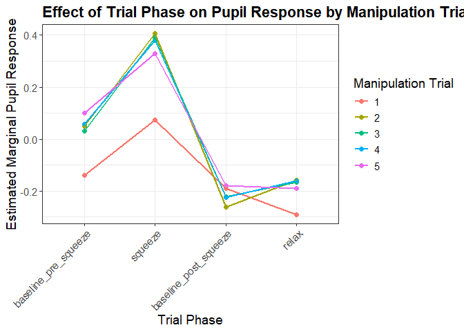<!-- -->

## Across Manipulation trials with groups - Habituation Effects

``` r
# Result 4
# Fit model with group × manipulation_trial × trial_phase interaction
lmm_trials_group <- lmer(
  trial_corr_rpd ~ group.y * manipulation_trial * trial_phase + (1 | id),
  data = df_grip
)

# Run and display ANOVA table
anova_table <- anova(lmm_trials_group)
knitr::kable(anova_table, caption = "ANOVA Results: Group × Trial × Phase Interaction")
```

|  | Sum Sq | Mean Sq | NumDF | DenDF | F value | Pr(\>F) |
|:---|---:|---:|---:|---:|---:|---:|
| group.y | 0.2547551 | 0.1273776 | 2 | 142.8629 | 1.2546423 | 0.2883007 |
| manipulation_trial | 8.0322001 | 2.0080500 | 4 | 2358.0847 | 19.7788707 | 0.0000000 |
| trial_phase | 116.8698260 | 38.9566087 | 3 | 2379.9064 | 383.7144074 | 0.0000000 |
| group.y:manipulation_trial | 0.1134831 | 0.0141854 | 8 | 2358.0868 | 0.1397231 | 0.9973795 |
| group.y:trial_phase | 2.4886897 | 0.4147816 | 6 | 2379.2287 | 4.0855117 | 0.0004392 |
| manipulation_trial:trial_phase | 6.4601257 | 0.5383438 | 12 | 2352.7388 | 5.3025734 | 0.0000000 |
| group.y:manipulation_trial:trial_phase | 1.9601540 | 0.0816731 | 24 | 2352.5445 | 0.8044627 | 0.7348206 |

ANOVA Results: Group × Trial × Phase Interaction

``` r
# Compute and display marginal/conditional R²
r2_group_trials <- r2_nakagawa(lmm_trials_group)
knitr::kable(r2_group_trials, caption = "Nakagawa R² for Group × Manipulation Trial × Phase Model")
```

<table class="kable_wrapper">
<caption>
Nakagawa R² for Group × Manipulation Trial × Phase Model
</caption>
<tbody>
<tr>
<td>

|                |        x |
|:---------------|---------:|
| Conditional R2 | 0.362882 |

</td>
<td>

|             |         x |
|:------------|----------:|
| Marginal R2 | 0.3557756 |

</td>
</tr>
</tbody>
</table>

``` r
# Compute estimated marginal means of trial_phase within each group × manipulation trial combination
emm_group_trial_phase <- emmeans(lmm_trials_group, ~ trial_phase | group.y * manipulation_trial)

# Display the results as a Markdown table
knitr::kable(emm_group_trial_phase, caption = "Estimated Marginal Means: Trial Phase by Group and Manipulation Trial")
```

| trial_phase | group.y | manipulation_trial | emmean | SE | df | lower.CL | upper.CL |
|:---|:---|:---|---:|---:|---:|---:|---:|
| baseline_pre_squeeze | ASD | 1 | -0.1137535 | 0.0494377 | 2467.537 | -0.2106971 | -0.0168099 |
| squeeze | ASD | 1 | 0.0643477 | 0.0453116 | 2465.177 | -0.0245049 | 0.1532003 |
| baseline_post_squeeze | ASD | 1 | -0.2199906 | 0.0575418 | 2469.569 | -0.3328259 | -0.1071554 |
| relax | ASD | 1 | -0.2328776 | 0.0448652 | 2464.845 | -0.3208550 | -0.1449001 |
| baseline_pre_squeeze | CON | 1 | -0.1383827 | 0.0462454 | 2466.346 | -0.2290665 | -0.0476988 |
| squeeze | CON | 1 | 0.1264803 | 0.0440106 | 2464.845 | 0.0401788 | 0.2127819 |
| baseline_post_squeeze | CON | 1 | -0.2138106 | 0.0605452 | 2469.880 | -0.3325352 | -0.0950859 |
| relax | CON | 1 | -0.3202601 | 0.0440106 | 2464.845 | -0.4065616 | -0.2339585 |
| baseline_pre_squeeze | MHC | 1 | -0.1723563 | 0.0549626 | 2465.664 | -0.2801338 | -0.0645787 |
| squeeze | MHC | 1 | 0.0139639 | 0.0494636 | 2459.081 | -0.0830306 | 0.1109584 |
| baseline_post_squeeze | MHC | 1 | -0.1118635 | 0.0717066 | 2467.347 | -0.2524748 | 0.0287478 |
| relax | MHC | 1 | -0.3289228 | 0.0494636 | 2459.081 | -0.4259173 | -0.2319282 |
| baseline_pre_squeeze | ASD | 2 | 0.0230095 | 0.0462456 | 2465.869 | -0.0676747 | 0.1136937 |
| squeeze | ASD | 2 | 0.3683897 | 0.0448652 | 2464.845 | 0.2804123 | 0.4563672 |
| baseline_post_squeeze | ASD | 2 | -0.2368488 | 0.0533976 | 2468.846 | -0.3415574 | -0.1321401 |
| relax | ASD | 2 | -0.1289908 | 0.0448652 | 2464.845 | -0.2169682 | -0.0410133 |
| baseline_pre_squeeze | CON | 2 | 0.0344616 | 0.0457713 | 2465.975 | -0.0552926 | 0.1242158 |
| squeeze | CON | 2 | 0.4546825 | 0.0440106 | 2464.845 | 0.3683810 | 0.5409841 |
| baseline_post_squeeze | CON | 2 | -0.2274932 | 0.0549453 | 2469.266 | -0.3352369 | -0.1197496 |
| relax | CON | 2 | -0.1837441 | 0.0440106 | 2464.845 | -0.2700456 | -0.0974425 |
| baseline_pre_squeeze | MHC | 2 | 0.1036400 | 0.0534294 | 2462.109 | -0.0011312 | 0.2084111 |
| squeeze | MHC | 2 | 0.3898868 | 0.0494636 | 2459.081 | 0.2928922 | 0.4868813 |
| baseline_post_squeeze | MHC | 2 | -0.3430867 | 0.0628797 | 2465.848 | -0.4663892 | -0.2197842 |
| relax | MHC | 2 | -0.1601313 | 0.0494636 | 2459.081 | -0.2571258 | -0.0631368 |
| baseline_pre_squeeze | ASD | 3 | 0.0411013 | 0.0494377 | 2467.506 | -0.0558424 | 0.1380449 |
| squeeze | ASD | 3 | 0.3358611 | 0.0448652 | 2464.845 | 0.2478836 | 0.4238386 |
| baseline_post_squeeze | ASD | 3 | -0.2052669 | 0.0541548 | 2469.028 | -0.3114604 | -0.0990734 |
| relax | ASD | 3 | -0.1139388 | 0.0453116 | 2465.159 | -0.2027915 | -0.0250862 |
| baseline_pre_squeeze | CON | 3 | 0.0458694 | 0.0453112 | 2465.831 | -0.0429826 | 0.1347214 |
| squeeze | CON | 3 | 0.4524203 | 0.0440106 | 2464.845 | 0.3661188 | 0.5387219 |
| baseline_post_squeeze | CON | 3 | -0.2019748 | 0.0594926 | 2469.797 | -0.3186354 | -0.0853143 |
| relax | CON | 3 | -0.2334902 | 0.0440106 | 2464.845 | -0.3197917 | -0.1471886 |
| baseline_pre_squeeze | MHC | 3 | 0.0001250 | 0.0520034 | 2461.111 | -0.1018499 | 0.1021000 |
| squeeze | MHC | 3 | 0.3767380 | 0.0494636 | 2459.081 | 0.2797434 | 0.4737325 |
| baseline_post_squeeze | MHC | 3 | -0.2617091 | 0.0617033 | 2465.401 | -0.3827047 | -0.1407135 |
| relax | MHC | 3 | -0.1405188 | 0.0494636 | 2459.081 | -0.2375133 | -0.0435242 |
| baseline_pre_squeeze | ASD | 4 | 0.1153306 | 0.0483014 | 2466.941 | 0.0206151 | 0.2100462 |
| squeeze | ASD | 4 | 0.3491222 | 0.0448652 | 2464.845 | 0.2611448 | 0.4370997 |
| baseline_post_squeeze | ASD | 4 | -0.2865538 | 0.0549452 | 2469.179 | -0.3942972 | -0.1788103 |
| relax | ASD | 4 | -0.1370490 | 0.0448652 | 2464.845 | -0.2250264 | -0.0490715 |
| baseline_pre_squeeze | CON | 4 | 0.0073071 | 0.0462454 | 2466.344 | -0.0833767 | 0.0979909 |
| squeeze | CON | 4 | 0.4448092 | 0.0440106 | 2464.845 | 0.3585076 | 0.5311107 |
| baseline_post_squeeze | CON | 4 | -0.1589905 | 0.0594926 | 2469.800 | -0.2756510 | -0.0423300 |
| relax | CON | 4 | -0.1674230 | 0.0444317 | 2465.112 | -0.2545503 | -0.0802957 |
| baseline_pre_squeeze | MHC | 4 | 0.0551458 | 0.0527021 | 2461.494 | -0.0481992 | 0.1584908 |
| squeeze | MHC | 4 | 0.3390746 | 0.0494636 | 2459.081 | 0.2420800 | 0.4360691 |
| baseline_post_squeeze | MHC | 4 | -0.2189812 | 0.0605899 | 2465.230 | -0.3377936 | -0.1001688 |
| relax | MHC | 4 | -0.1806790 | 0.0500634 | 2459.676 | -0.2788498 | -0.0825081 |
| baseline_pre_squeeze | ASD | 5 | 0.1465939 | 0.0483014 | 2466.953 | 0.0518784 | 0.2413094 |
| squeeze | ASD | 5 | 0.2539920 | 0.0453116 | 2465.176 | 0.1651394 | 0.3428446 |
| baseline_post_squeeze | ASD | 5 | -0.1726119 | 0.0557713 | 2469.315 | -0.2819753 | -0.0632485 |
| relax | ASD | 5 | -0.1890774 | 0.0448652 | 2464.845 | -0.2770548 | -0.1010999 |
| baseline_pre_squeeze | CON | 5 | 0.1172379 | 0.0500366 | 2468.073 | 0.0191199 | 0.2153560 |
| squeeze | CON | 5 | 0.4285390 | 0.0440106 | 2464.845 | 0.3422374 | 0.5148405 |
| baseline_post_squeeze | CON | 5 | -0.1411581 | 0.0616561 | 2469.928 | -0.2620609 | -0.0202552 |
| relax | CON | 5 | -0.2423006 | 0.0440106 | 2464.845 | -0.3286022 | -0.1559991 |
| baseline_pre_squeeze | MHC | 5 | 0.0267903 | 0.0527019 | 2461.685 | -0.0765542 | 0.1301348 |
| squeeze | MHC | 5 | 0.2926584 | 0.0494636 | 2459.081 | 0.1956639 | 0.3896529 |
| baseline_post_squeeze | MHC | 5 | -0.2394177 | 0.0716716 | 2469.200 | -0.3799603 | -0.0988752 |
| relax | MHC | 5 | -0.1232570 | 0.0494636 | 2459.081 | -0.2202515 | -0.0262624 |

Estimated Marginal Means: Trial Phase by Group and Manipulation Trial

### Post Hoc

``` r
# Compute EMMs for trial_phase within each group × manipulation_trial
emm_nested <- emmeans(lmm_trials_group, ~ trial_phase | group.y * manipulation_trial)

# Pairwise contrasts
nested_contrasts <- contrast(emm_nested, "pairwise")
knitr::kable(nested_contrasts, caption = "Pairwise Comparisons: Trial Phase by Group × Manipulation Trial")
```

| contrast | group.y | manipulation_trial | estimate | SE | df | t.ratio | p.value |
|:---|:---|:---|---:|---:|---:|---:|---:|
| baseline_pre_squeeze - squeeze | ASD | 1 | -0.1781012 | 0.0667229 | 2350.643 | -2.6692658 | 0.0383210 |
| baseline_pre_squeeze - baseline_post_squeeze | ASD | 1 | 0.1062372 | 0.0755530 | 2384.363 | 1.4061283 | 0.4955744 |
| baseline_pre_squeeze - relax | ASD | 1 | 0.1191241 | 0.0664271 | 2352.740 | 1.7933043 | 0.2767529 |
| squeeze - baseline_post_squeeze | ASD | 1 | 0.2843383 | 0.0729310 | 2379.582 | 3.8987326 | 0.0005751 |
| squeeze - relax | ASD | 1 | 0.2972253 | 0.0634162 | 2333.844 | 4.6868951 | 0.0000174 |
| baseline_post_squeeze - relax | ASD | 1 | 0.0128869 | 0.0726605 | 2381.328 | 0.1773579 | 0.9980191 |
| baseline_pre_squeeze - squeeze | CON | 1 | -0.2648630 | 0.0635046 | 2342.764 | -4.1707671 | 0.0001843 |
| baseline_pre_squeeze - baseline_post_squeeze | CON | 1 | 0.0754279 | 0.0758877 | 2389.669 | 0.9939413 | 0.7529013 |
| baseline_pre_squeeze - relax | CON | 1 | 0.1818774 | 0.0635046 | 2342.764 | 2.8640021 | 0.0219317 |
| squeeze - baseline_post_squeeze | CON | 1 | 0.3402909 | 0.0745649 | 2393.052 | 4.5636865 | 0.0000313 |
| squeeze - relax | CON | 1 | 0.4467404 | 0.0618961 | 2331.570 | 7.2175805 | 0.0000000 |
| baseline_post_squeeze - relax | CON | 1 | 0.1064495 | 0.0745649 | 2393.052 | 1.4276082 | 0.4821303 |
| baseline_pre_squeeze - squeeze | MHC | 1 | -0.1863202 | 0.0735560 | 2356.271 | -2.5330386 | 0.0552247 |
| baseline_pre_squeeze - baseline_post_squeeze | MHC | 1 | -0.0604928 | 0.0900168 | 2414.383 | -0.6720170 | 0.9076817 |
| baseline_pre_squeeze - relax | MHC | 1 | 0.1565665 | 0.0735560 | 2356.271 | 2.1285344 | 0.1443361 |
| squeeze - baseline_post_squeeze | MHC | 1 | 0.1258274 | 0.0867451 | 2403.592 | 1.4505419 | 0.4678850 |
| squeeze - relax | MHC | 1 | 0.3428867 | 0.0695307 | 2331.570 | 4.9314398 | 0.0000052 |
| baseline_post_squeeze - relax | MHC | 1 | 0.2170593 | 0.0867451 | 2403.592 | 2.5022659 | 0.0597989 |
| baseline_pre_squeeze - squeeze | ASD | 2 | -0.3453802 | 0.0640869 | 2338.310 | -5.3892456 | 0.0000005 |
| baseline_pre_squeeze - baseline_post_squeeze | ASD | 2 | 0.2598582 | 0.0703145 | 2366.880 | 3.6956547 | 0.0012822 |
| baseline_pre_squeeze - relax | ASD | 2 | 0.1520003 | 0.0640869 | 2338.310 | 2.3717825 | 0.0828443 |
| squeeze - baseline_post_squeeze | ASD | 2 | 0.6052385 | 0.0694247 | 2367.908 | 8.7179168 | 0.0000000 |
| squeeze - relax | ASD | 2 | 0.4973805 | 0.0630981 | 2331.570 | 7.8826517 | 0.0000000 |
| baseline_post_squeeze - relax | ASD | 2 | -0.1078580 | 0.0694247 | 2367.908 | -1.5535972 | 0.4056434 |
| baseline_pre_squeeze - squeeze | CON | 2 | -0.4202209 | 0.0631602 | 2340.724 | -6.6532536 | 0.0000000 |
| baseline_pre_squeeze - baseline_post_squeeze | CON | 2 | 0.2619548 | 0.0712075 | 2379.339 | 3.6787521 | 0.0013679 |
| baseline_pre_squeeze - relax | CON | 2 | 0.2182057 | 0.0631602 | 2340.724 | 3.4547962 | 0.0031432 |
| squeeze - baseline_post_squeeze | CON | 2 | 0.6821758 | 0.0700941 | 2377.274 | 9.7322800 | 0.0000000 |
| squeeze - relax | CON | 2 | 0.6384266 | 0.0618961 | 2331.570 | 10.3144810 | 0.0000000 |
| baseline_post_squeeze - relax | CON | 2 | -0.0437492 | 0.0700941 | 2377.274 | -0.6241488 | 0.9243542 |
| baseline_pre_squeeze - squeeze | MHC | 2 | -0.2862468 | 0.0724004 | 2348.696 | -3.9536620 | 0.0004599 |
| baseline_pre_squeeze - baseline_post_squeeze | MHC | 2 | 0.4467267 | 0.0821229 | 2385.393 | 5.4397346 | 0.0000004 |
| baseline_pre_squeeze - relax | MHC | 2 | 0.2637712 | 0.0724004 | 2348.696 | 3.6432278 | 0.0015666 |
| squeeze - baseline_post_squeeze | MHC | 2 | 0.7329735 | 0.0796175 | 2381.373 | 9.2061908 | 0.0000000 |
| squeeze - relax | MHC | 2 | 0.5500181 | 0.0695307 | 2331.570 | 7.9104298 | 0.0000000 |
| baseline_post_squeeze - relax | MHC | 2 | -0.1829554 | 0.0796175 | 2381.373 | -2.2979309 | 0.0987620 |
| baseline_pre_squeeze - squeeze | ASD | 3 | -0.2947598 | 0.0664272 | 2352.850 | -4.4373384 | 0.0000563 |
| baseline_pre_squeeze - baseline_post_squeeze | ASD | 3 | 0.2463681 | 0.0730216 | 2382.125 | 3.3739078 | 0.0041899 |
| baseline_pre_squeeze - relax | ASD | 3 | 0.1550401 | 0.0667308 | 2355.479 | 2.3233651 | 0.0930285 |
| squeeze - baseline_post_squeeze | ASD | 3 | 0.5411280 | 0.0700087 | 2370.475 | 7.7294350 | 0.0000000 |
| squeeze - relax | ASD | 3 | 0.4497999 | 0.0634163 | 2333.887 | 7.0928183 | 0.0000000 |
| baseline_post_squeeze - relax | ASD | 3 | -0.0913280 | 0.0702894 | 2368.537 | -1.2993142 | 0.5634288 |
| baseline_pre_squeeze - squeeze | CON | 3 | -0.4065509 | 0.0628276 | 2338.056 | -6.4708962 | 0.0000000 |
| baseline_pre_squeeze - baseline_post_squeeze | CON | 3 | 0.2478442 | 0.0744901 | 2390.241 | 3.3272118 | 0.0049314 |
| baseline_pre_squeeze - relax | CON | 3 | 0.2793596 | 0.0628276 | 2338.056 | 4.4464461 | 0.0000540 |
| squeeze - baseline_post_squeeze | CON | 3 | 0.6543952 | 0.0737128 | 2390.577 | 8.8776382 | 0.0000000 |
| squeeze - relax | CON | 3 | 0.6859105 | 0.0618961 | 2331.570 | 11.0816354 | 0.0000000 |
| baseline_post_squeeze - relax | CON | 3 | 0.0315153 | 0.0737128 | 2390.577 | 0.4275424 | 0.9737703 |
| baseline_pre_squeeze - squeeze | MHC | 3 | -0.3766129 | 0.0713565 | 2342.879 | -5.2779028 | 0.0000009 |
| baseline_pre_squeeze - baseline_post_squeeze | MHC | 3 | 0.2618341 | 0.0803020 | 2380.535 | 3.2606167 | 0.0061979 |
| baseline_pre_squeeze - relax | MHC | 3 | 0.1406438 | 0.0713565 | 2342.879 | 1.9710006 | 0.1992896 |
| squeeze - baseline_post_squeeze | MHC | 3 | 0.6384470 | 0.0786933 | 2378.180 | 8.1131031 | 0.0000000 |
| squeeze - relax | MHC | 3 | 0.5172567 | 0.0695307 | 2331.570 | 7.4392518 | 0.0000000 |
| baseline_post_squeeze - relax | MHC | 3 | -0.1211903 | 0.0786933 | 2378.180 | -1.5400331 | 0.4136448 |
| baseline_pre_squeeze - squeeze | ASD | 4 | -0.2337916 | 0.0655859 | 2348.092 | -3.5646623 | 0.0021036 |
| baseline_pre_squeeze - baseline_post_squeeze | ASD | 4 | 0.4018844 | 0.0728362 | 2373.850 | 5.5176425 | 0.0000002 |
| baseline_pre_squeeze - relax | ASD | 4 | 0.2523796 | 0.0655859 | 2348.092 | 3.8480762 | 0.0007053 |
| squeeze - baseline_post_squeeze | ASD | 4 | 0.6356760 | 0.0706219 | 2373.172 | 9.0011114 | 0.0000000 |
| squeeze - relax | ASD | 4 | 0.4861712 | 0.0630981 | 2331.570 | 7.7050026 | 0.0000000 |
| baseline_post_squeeze - relax | ASD | 4 | -0.1495048 | 0.0706219 | 2373.172 | -2.1169737 | 0.1479391 |
| baseline_pre_squeeze - squeeze | CON | 4 | -0.4375021 | 0.0635046 | 2342.769 | -6.8892960 | 0.0000000 |
| baseline_pre_squeeze - baseline_post_squeeze | CON | 4 | 0.1662976 | 0.0750501 | 2386.865 | 2.2158211 | 0.1191980 |
| baseline_pre_squeeze - relax | CON | 4 | 0.1747301 | 0.0637908 | 2340.528 | 2.7391094 | 0.0315213 |
| squeeze - baseline_post_squeeze | CON | 4 | 0.6037997 | 0.0737127 | 2390.532 | 8.1912540 | 0.0000000 |
| squeeze - relax | CON | 4 | 0.6122322 | 0.0621963 | 2333.888 | 9.8435530 | 0.0000000 |
| baseline_post_squeeze - relax | CON | 4 | 0.0084325 | 0.0739595 | 2388.897 | 0.1140146 | 0.9994701 |
| baseline_pre_squeeze - squeeze | MHC | 4 | -0.2839288 | 0.0718663 | 2345.946 | -3.9507899 | 0.0004653 |
| baseline_pre_squeeze - baseline_post_squeeze | MHC | 4 | 0.2741270 | 0.0799258 | 2385.895 | 3.4297672 | 0.0034373 |
| baseline_pre_squeeze - relax | MHC | 4 | 0.2358248 | 0.0722809 | 2348.826 | 3.2626164 | 0.0061570 |
| squeeze - baseline_post_squeeze | MHC | 4 | 0.5580558 | 0.0778251 | 2374.416 | 7.1706401 | 0.0000000 |
| squeeze - relax | MHC | 4 | 0.5197535 | 0.0699580 | 2334.238 | 7.4295106 | 0.0000000 |
| baseline_post_squeeze - relax | MHC | 4 | -0.0383022 | 0.0782108 | 2377.635 | -0.4897309 | 0.9614002 |
| baseline_pre_squeeze - squeeze | ASD | 5 | -0.1073981 | 0.0658854 | 2345.912 | -1.6300736 | 0.3618083 |
| baseline_pre_squeeze - baseline_post_squeeze | ASD | 5 | 0.3192058 | 0.0734624 | 2377.048 | 4.3451563 | 0.0000854 |
| baseline_pre_squeeze - relax | ASD | 5 | 0.3356712 | 0.0655859 | 2348.054 | 5.1180400 | 0.0000020 |
| squeeze - baseline_post_squeeze | ASD | 5 | 0.4266039 | 0.0715517 | 2378.807 | 5.9621772 | 0.0000000 |
| squeeze - relax | ASD | 5 | 0.4430694 | 0.0634162 | 2333.845 | 6.9866864 | 0.0000000 |
| baseline_post_squeeze - relax | ASD | 5 | 0.0164655 | 0.0712666 | 2375.916 | 0.2310405 | 0.9956567 |
| baseline_pre_squeeze - squeeze | CON | 5 | -0.3113010 | 0.0663164 | 2359.370 | -4.6941807 | 0.0000168 |
| baseline_pre_squeeze - baseline_post_squeeze | CON | 5 | 0.2583960 | 0.0791087 | 2395.590 | 3.2663389 | 0.0060780 |
| baseline_pre_squeeze - relax | CON | 5 | 0.3595386 | 0.0663164 | 2359.370 | 5.4215653 | 0.0000004 |
| squeeze - baseline_post_squeeze | CON | 5 | 0.5696970 | 0.0754697 | 2395.839 | 7.5486899 | 0.0000000 |
| squeeze - relax | CON | 5 | 0.6708396 | 0.0618961 | 2331.570 | 10.8381487 | 0.0000000 |
| baseline_post_squeeze - relax | CON | 5 | 0.1011426 | 0.0754697 | 2395.839 | 1.3401752 | 0.5373280 |
| baseline_pre_squeeze - squeeze | MHC | 5 | -0.2658681 | 0.0718662 | 2345.642 | -3.6994867 | 0.0012636 |
| baseline_pre_squeeze - baseline_post_squeeze | MHC | 5 | 0.2662080 | 0.0886535 | 2416.227 | 3.0027910 | 0.0143629 |
| baseline_pre_squeeze - relax | MHC | 5 | 0.1500473 | 0.0718662 | 2345.642 | 2.0878695 | 0.1573130 |
| squeeze - baseline_post_squeeze | MHC | 5 | 0.5320761 | 0.0867435 | 2403.140 | 6.1339047 | 0.0000000 |
| squeeze - relax | MHC | 5 | 0.4159154 | 0.0695307 | 2331.570 | 5.9817477 | 0.0000000 |
| baseline_post_squeeze - relax | MHC | 5 | -0.1161608 | 0.0867435 | 2403.140 | -1.3391298 | 0.5379939 |

Pairwise Comparisons: Trial Phase by Group × Manipulation Trial

``` r
# Confidence intervals for those contrasts
nested_contrasts_ci <- confint(nested_contrasts)
knitr::kable(nested_contrasts_ci, caption = "95% CIs for Trial Phase Comparisons by Group × Manipulation Trial")
```

| contrast | group.y | manipulation_trial | estimate | SE | df | lower.CL | upper.CL |
|:---|:---|:---|---:|---:|---:|---:|---:|
| baseline_pre_squeeze - squeeze | ASD | 1 | -0.1781012 | 0.0667229 | 2350.643 | -0.3496371 | -0.0065652 |
| baseline_pre_squeeze - baseline_post_squeeze | ASD | 1 | 0.1062372 | 0.0755530 | 2384.363 | -0.0879977 | 0.3004721 |
| baseline_pre_squeeze - relax | ASD | 1 | 0.1191241 | 0.0664271 | 2352.740 | -0.0516514 | 0.2898995 |
| squeeze - baseline_post_squeeze | ASD | 1 | 0.2843383 | 0.0729310 | 2379.582 | 0.0968439 | 0.4718328 |
| squeeze - relax | ASD | 1 | 0.2972253 | 0.0634162 | 2333.844 | 0.1341895 | 0.4602610 |
| baseline_post_squeeze - relax | ASD | 1 | 0.0128869 | 0.0726605 | 2381.328 | -0.1739120 | 0.1996858 |
| baseline_pre_squeeze - squeeze | CON | 1 | -0.2648630 | 0.0635046 | 2342.764 | -0.4281255 | -0.1016005 |
| baseline_pre_squeeze - baseline_post_squeeze | CON | 1 | 0.0754279 | 0.0758877 | 2389.669 | -0.1196672 | 0.2705230 |
| baseline_pre_squeeze - relax | CON | 1 | 0.1818774 | 0.0635046 | 2342.764 | 0.0186148 | 0.3451399 |
| squeeze - baseline_post_squeeze | CON | 1 | 0.3402909 | 0.0745649 | 2393.052 | 0.1485966 | 0.5319852 |
| squeeze - relax | CON | 1 | 0.4467404 | 0.0618961 | 2331.570 | 0.2876125 | 0.6058683 |
| baseline_post_squeeze - relax | CON | 1 | 0.1064495 | 0.0745649 | 2393.052 | -0.0852448 | 0.2981438 |
| baseline_pre_squeeze - squeeze | MHC | 1 | -0.1863202 | 0.0735560 | 2356.271 | -0.3754228 | 0.0027824 |
| baseline_pre_squeeze - baseline_post_squeeze | MHC | 1 | -0.0604928 | 0.0900168 | 2414.383 | -0.2919099 | 0.1709243 |
| baseline_pre_squeeze - relax | MHC | 1 | 0.1565665 | 0.0735560 | 2356.271 | -0.0325361 | 0.3456691 |
| squeeze - baseline_post_squeeze | MHC | 1 | 0.1258274 | 0.0867451 | 2403.592 | -0.0971795 | 0.3488342 |
| squeeze - relax | MHC | 1 | 0.3428867 | 0.0695307 | 2331.570 | 0.1641311 | 0.5216422 |
| baseline_post_squeeze - relax | MHC | 1 | 0.2170593 | 0.0867451 | 2403.592 | -0.0059476 | 0.4400661 |
| baseline_pre_squeeze - squeeze | ASD | 2 | -0.3453802 | 0.0640869 | 2338.310 | -0.5101401 | -0.1806204 |
| baseline_pre_squeeze - baseline_post_squeeze | ASD | 2 | 0.2598582 | 0.0703145 | 2366.880 | 0.0790896 | 0.4406269 |
| baseline_pre_squeeze - relax | ASD | 2 | 0.1520003 | 0.0640869 | 2338.310 | -0.0127595 | 0.3167601 |
| squeeze - baseline_post_squeeze | ASD | 2 | 0.6052385 | 0.0694247 | 2367.908 | 0.4267576 | 0.7837194 |
| squeeze - relax | ASD | 2 | 0.4973805 | 0.0630981 | 2331.570 | 0.3351625 | 0.6595985 |
| baseline_post_squeeze - relax | ASD | 2 | -0.1078580 | 0.0694247 | 2367.908 | -0.2863389 | 0.0706229 |
| baseline_pre_squeeze - squeeze | CON | 2 | -0.4202209 | 0.0631602 | 2340.724 | -0.5825981 | -0.2578437 |
| baseline_pre_squeeze - baseline_post_squeeze | CON | 2 | 0.2619548 | 0.0712075 | 2379.339 | 0.0788911 | 0.4450186 |
| baseline_pre_squeeze - relax | CON | 2 | 0.2182057 | 0.0631602 | 2340.724 | 0.0558285 | 0.3805829 |
| squeeze - baseline_post_squeeze | CON | 2 | 0.6821758 | 0.0700941 | 2377.274 | 0.5019743 | 0.8623772 |
| squeeze - relax | CON | 2 | 0.6384266 | 0.0618961 | 2331.570 | 0.4792987 | 0.7975545 |
| baseline_post_squeeze - relax | CON | 2 | -0.0437492 | 0.0700941 | 2377.274 | -0.2239506 | 0.1364523 |
| baseline_pre_squeeze - squeeze | MHC | 2 | -0.2862468 | 0.0724004 | 2348.696 | -0.4723790 | -0.1001146 |
| baseline_pre_squeeze - baseline_post_squeeze | MHC | 2 | 0.4467267 | 0.0821229 | 2385.393 | 0.2356016 | 0.6578517 |
| baseline_pre_squeeze - relax | MHC | 2 | 0.2637712 | 0.0724004 | 2348.696 | 0.0776390 | 0.4499035 |
| squeeze - baseline_post_squeeze | MHC | 2 | 0.7329735 | 0.0796175 | 2381.373 | 0.5282892 | 0.9376577 |
| squeeze - relax | MHC | 2 | 0.5500181 | 0.0695307 | 2331.570 | 0.3712625 | 0.7287736 |
| baseline_post_squeeze - relax | MHC | 2 | -0.1829554 | 0.0796175 | 2381.373 | -0.3876397 | 0.0217288 |
| baseline_pre_squeeze - squeeze | ASD | 3 | -0.2947598 | 0.0664272 | 2352.850 | -0.4655354 | -0.1239843 |
| baseline_pre_squeeze - baseline_post_squeeze | ASD | 3 | 0.2463681 | 0.0730216 | 2382.125 | 0.0586409 | 0.4340954 |
| baseline_pre_squeeze - relax | ASD | 3 | 0.1550401 | 0.0667308 | 2355.479 | -0.0165160 | 0.3265962 |
| squeeze - baseline_post_squeeze | ASD | 3 | 0.5411280 | 0.0700087 | 2370.475 | 0.3611457 | 0.7211103 |
| squeeze - relax | ASD | 3 | 0.4497999 | 0.0634163 | 2333.887 | 0.2867642 | 0.6128357 |
| baseline_post_squeeze - relax | ASD | 3 | -0.0913280 | 0.0702894 | 2368.537 | -0.2720321 | 0.0893760 |
| baseline_pre_squeeze - squeeze | CON | 3 | -0.4065509 | 0.0628276 | 2338.056 | -0.5680732 | -0.2450287 |
| baseline_pre_squeeze - baseline_post_squeeze | CON | 3 | 0.2478442 | 0.0744901 | 2390.241 | 0.0563422 | 0.4393463 |
| baseline_pre_squeeze - relax | CON | 3 | 0.2793596 | 0.0628276 | 2338.056 | 0.1178373 | 0.4408818 |
| squeeze - baseline_post_squeeze | CON | 3 | 0.6543952 | 0.0737128 | 2390.577 | 0.4648915 | 0.8438988 |
| squeeze - relax | CON | 3 | 0.6859105 | 0.0618961 | 2331.570 | 0.5267826 | 0.8450384 |
| baseline_post_squeeze - relax | CON | 3 | 0.0315153 | 0.0737128 | 2390.577 | -0.1579883 | 0.2210190 |
| baseline_pre_squeeze - squeeze | MHC | 3 | -0.3766129 | 0.0713565 | 2342.879 | -0.5600618 | -0.1931641 |
| baseline_pre_squeeze - baseline_post_squeeze | MHC | 3 | 0.2618341 | 0.0803020 | 2380.535 | 0.0553899 | 0.4682783 |
| baseline_pre_squeeze - relax | MHC | 3 | 0.1406438 | 0.0713565 | 2342.879 | -0.0428051 | 0.3240926 |
| squeeze - baseline_post_squeeze | MHC | 3 | 0.6384470 | 0.0786933 | 2378.180 | 0.4361384 | 0.8407557 |
| squeeze - relax | MHC | 3 | 0.5172567 | 0.0695307 | 2331.570 | 0.3385011 | 0.6960123 |
| baseline_post_squeeze - relax | MHC | 3 | -0.1211903 | 0.0786933 | 2378.180 | -0.3234990 | 0.0811183 |
| baseline_pre_squeeze - squeeze | ASD | 4 | -0.2337916 | 0.0655859 | 2348.092 | -0.4024046 | -0.0651786 |
| baseline_pre_squeeze - baseline_post_squeeze | ASD | 4 | 0.4018844 | 0.0728362 | 2373.850 | 0.2146332 | 0.5891356 |
| baseline_pre_squeeze - relax | ASD | 4 | 0.2523796 | 0.0655859 | 2348.092 | 0.0837666 | 0.4209926 |
| squeeze - baseline_post_squeeze | ASD | 4 | 0.6356760 | 0.0706219 | 2373.172 | 0.4541174 | 0.8172346 |
| squeeze - relax | ASD | 4 | 0.4861712 | 0.0630981 | 2331.570 | 0.3239532 | 0.6483892 |
| baseline_post_squeeze - relax | ASD | 4 | -0.1495048 | 0.0706219 | 2373.172 | -0.3310634 | 0.0320538 |
| baseline_pre_squeeze - squeeze | CON | 4 | -0.4375021 | 0.0635046 | 2342.769 | -0.6007646 | -0.2742396 |
| baseline_pre_squeeze - baseline_post_squeeze | CON | 4 | 0.1662976 | 0.0750501 | 2386.865 | -0.0266444 | 0.3592396 |
| baseline_pre_squeeze - relax | CON | 4 | 0.1747301 | 0.0637908 | 2340.528 | 0.0107316 | 0.3387285 |
| squeeze - baseline_post_squeeze | CON | 4 | 0.6037997 | 0.0737127 | 2390.532 | 0.4142961 | 0.7933033 |
| squeeze - relax | CON | 4 | 0.6122322 | 0.0621963 | 2333.888 | 0.4523328 | 0.7721315 |
| baseline_post_squeeze - relax | CON | 4 | 0.0084325 | 0.0739595 | 2388.897 | -0.1817055 | 0.1985704 |
| baseline_pre_squeeze - squeeze | MHC | 4 | -0.2839288 | 0.0718663 | 2345.946 | -0.4686881 | -0.0991695 |
| baseline_pre_squeeze - baseline_post_squeeze | MHC | 4 | 0.2741270 | 0.0799258 | 2385.895 | 0.0686502 | 0.4796038 |
| baseline_pre_squeeze - relax | MHC | 4 | 0.2358248 | 0.0722809 | 2348.826 | 0.0499999 | 0.4216496 |
| squeeze - baseline_post_squeeze | MHC | 4 | 0.5580558 | 0.0778251 | 2374.416 | 0.3579790 | 0.7581326 |
| squeeze - relax | MHC | 4 | 0.5197535 | 0.0699580 | 2334.238 | 0.3398998 | 0.6996073 |
| baseline_post_squeeze - relax | MHC | 4 | -0.0383022 | 0.0782108 | 2377.635 | -0.2393704 | 0.1627659 |
| baseline_pre_squeeze - squeeze | ASD | 5 | -0.1073981 | 0.0658854 | 2345.912 | -0.2767813 | 0.0619850 |
| baseline_pre_squeeze - baseline_post_squeeze | ASD | 5 | 0.3192058 | 0.0734624 | 2377.048 | 0.1303449 | 0.5080667 |
| baseline_pre_squeeze - relax | ASD | 5 | 0.3356712 | 0.0655859 | 2348.054 | 0.1670583 | 0.5042842 |
| squeeze - baseline_post_squeeze | ASD | 5 | 0.4266039 | 0.0715517 | 2378.807 | 0.2426553 | 0.6105525 |
| squeeze - relax | ASD | 5 | 0.4430694 | 0.0634162 | 2333.845 | 0.2800336 | 0.6061051 |
| baseline_post_squeeze - relax | ASD | 5 | 0.0164655 | 0.0712666 | 2375.916 | -0.1667502 | 0.1996812 |
| baseline_pre_squeeze - squeeze | CON | 5 | -0.3113010 | 0.0663164 | 2359.370 | -0.4817914 | -0.1408107 |
| baseline_pre_squeeze - baseline_post_squeeze | CON | 5 | 0.2583960 | 0.0791087 | 2395.590 | 0.0550204 | 0.4617716 |
| baseline_pre_squeeze - relax | CON | 5 | 0.3595386 | 0.0663164 | 2359.370 | 0.1890482 | 0.5300289 |
| squeeze - baseline_post_squeeze | CON | 5 | 0.5696970 | 0.0754697 | 2395.839 | 0.3756770 | 0.7637171 |
| squeeze - relax | CON | 5 | 0.6708396 | 0.0618961 | 2331.570 | 0.5117117 | 0.8299675 |
| baseline_post_squeeze - relax | CON | 5 | 0.1011426 | 0.0754697 | 2395.839 | -0.0928775 | 0.2951626 |
| baseline_pre_squeeze - squeeze | MHC | 5 | -0.2658681 | 0.0718662 | 2345.642 | -0.4506271 | -0.0811091 |
| baseline_pre_squeeze - baseline_post_squeeze | MHC | 5 | 0.2662080 | 0.0886535 | 2416.227 | 0.0382957 | 0.4941203 |
| baseline_pre_squeeze - relax | MHC | 5 | 0.1500473 | 0.0718662 | 2345.642 | -0.0347117 | 0.3348062 |
| squeeze - baseline_post_squeeze | MHC | 5 | 0.5320761 | 0.0867435 | 2403.140 | 0.3090734 | 0.7550788 |
| squeeze - relax | MHC | 5 | 0.4159154 | 0.0695307 | 2331.570 | 0.2371598 | 0.5946709 |
| baseline_post_squeeze - relax | MHC | 5 | -0.1161608 | 0.0867435 | 2403.140 | -0.3391634 | 0.1068419 |

95% CIs for Trial Phase Comparisons by Group × Manipulation Trial

``` r
# Get estimated marginal means for the interaction
emm_data <- emmip(
  lmm_trials_group,
  ~ trial_phase | group.y * manipulation_trial,
  CIs = TRUE,
  plotit = FALSE
)

# Ensure correct order of trial phases
emm_data$trial_phase <- factor(
  emm_data$trial_phase,
  levels = c("baseline_pre_squeeze", "squeeze", "baseline_post_squeeze", "relax")
)

# Plot
ggplot(emm_data, aes(x = trial_phase, y = yvar, group = manipulation_trial, color = as.factor(manipulation_trial))) +
  geom_point(size = 2) +
  geom_line(size = 1) +
  #geom_errorbar(aes(ymin = LCL, ymax = UCL), width = 0.2) +
  facet_wrap(~ group.y) +
  scale_x_discrete(labels = c(
    "baseline_pre_squeeze" = "Baseline Pre Grip",
    "squeeze" = "Grip",
    "baseline_post_squeeze" = "Baseline Post Grip",
    "relax" = "Relax"
  )) +
  labs(
    title = "Group × Manipulation Trial × Phase Interaction on Pupil Response",
    x = "Trial Phase",
    y = "Estimated Marginal Pupil Response",
    color = "Manipulation Trial"
  ) +
  theme_bw() +
  theme(
    plot.title = element_text(face = "bold"),
    axis.text.x = element_text(angle = 45, hjust = 1),
    text = element_text(size = 14)
  )
```

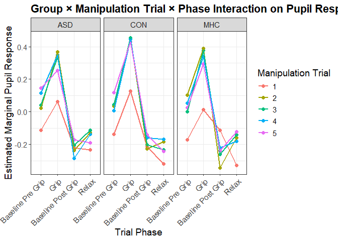<!-- -->

## Assumption checks

### Baseline model - Effect of Experimental Manipulation

``` r
check_model(lmm_baseline)
```

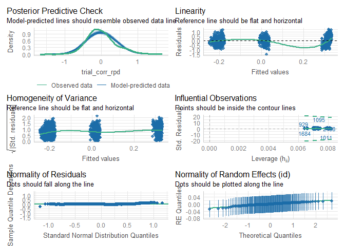<!-- -->

``` r
performance::check_model(lmm_baseline)
```

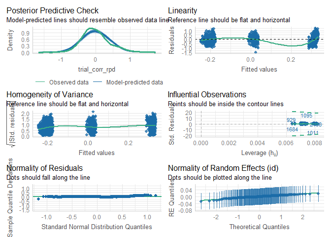<!-- -->

### Group

``` r
check_model(lmm_group)
```

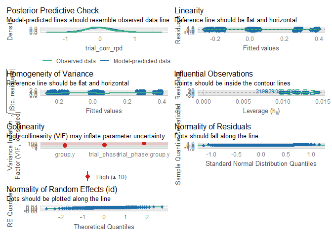<!-- -->

``` r
performance::check_model(lmm_group)
```

<!-- -->

### Across trials - Habituation effects

``` r
check_model(lmm_trials)
```

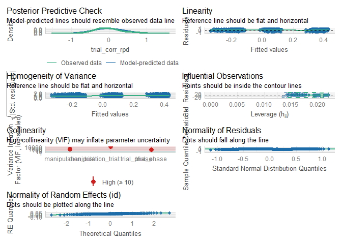<!-- -->

``` r
performance::check_model(lmm_trials)
```

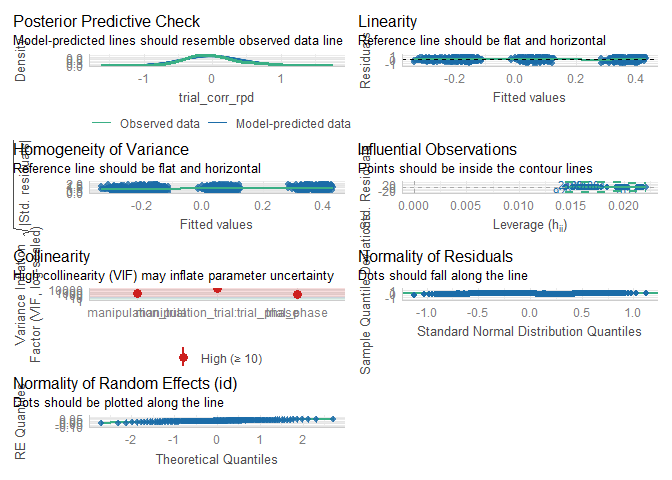<!-- -->

### Habituation effects with groups

``` r
check_model(lmm_trials_group)
```

<!-- -->

``` r
performance::check_model(lmm_trials_group)
```

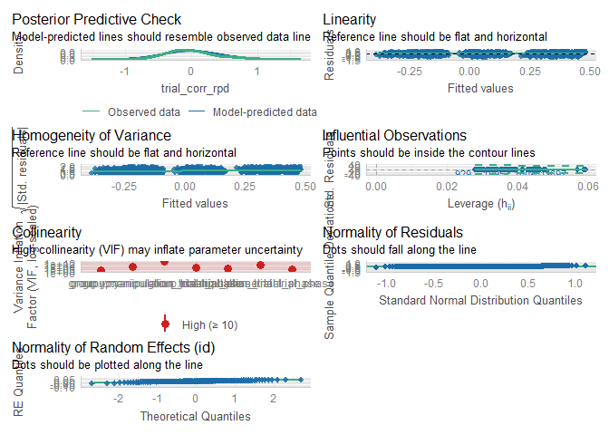<!-- -->
